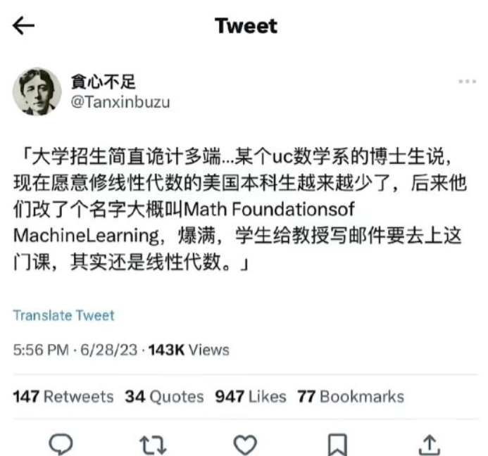
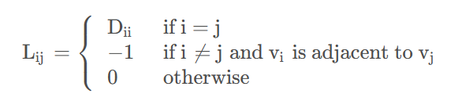
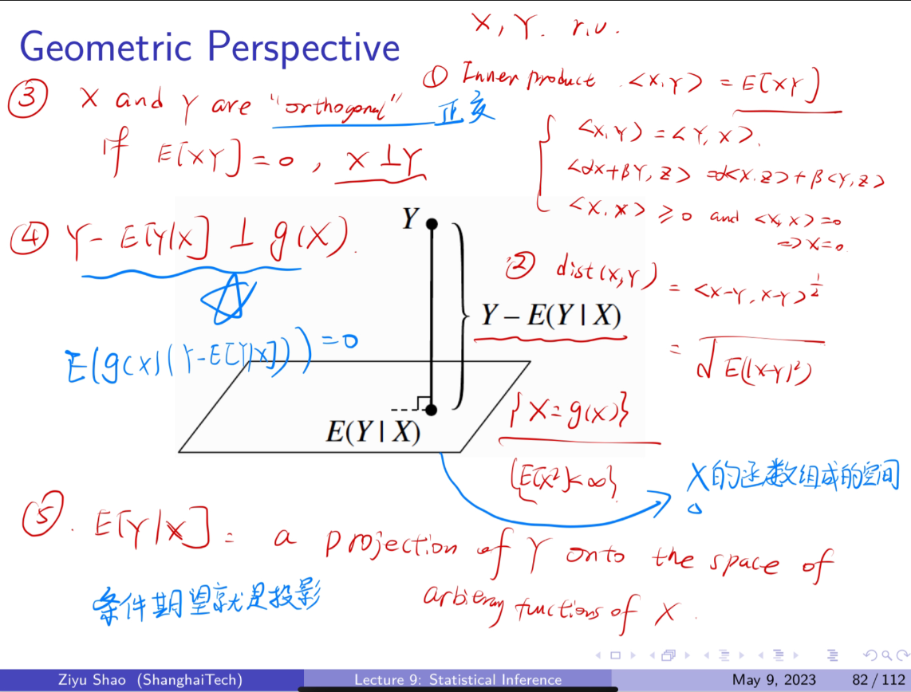
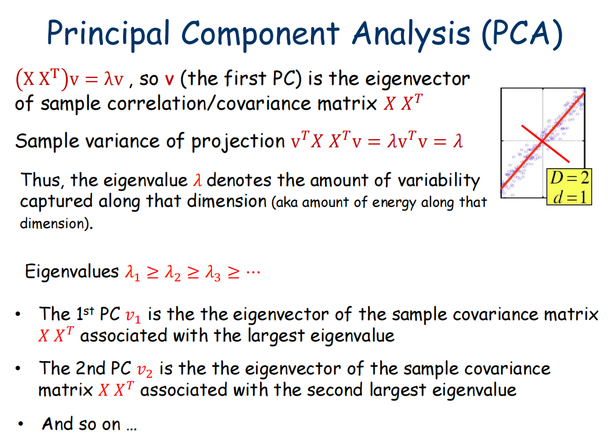
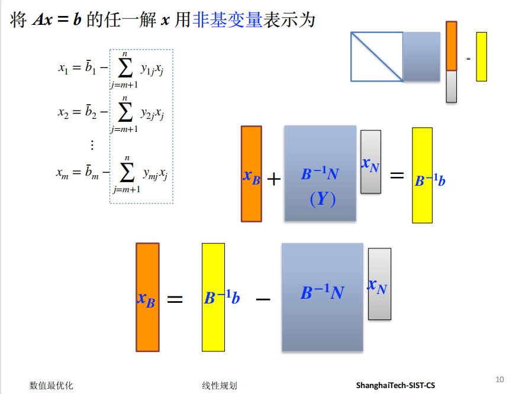
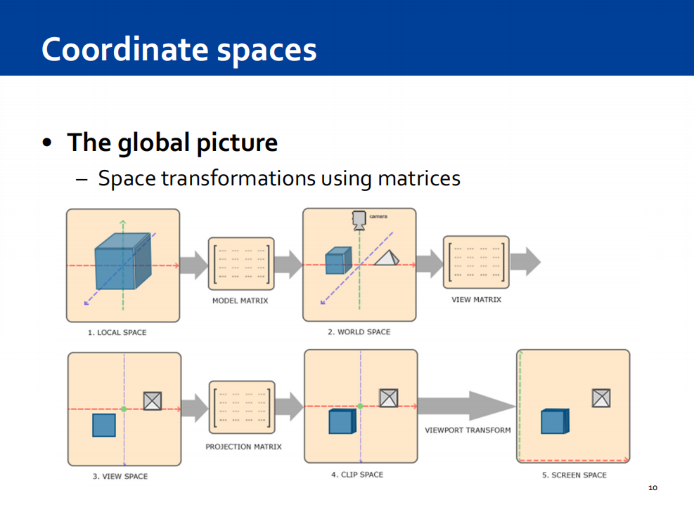
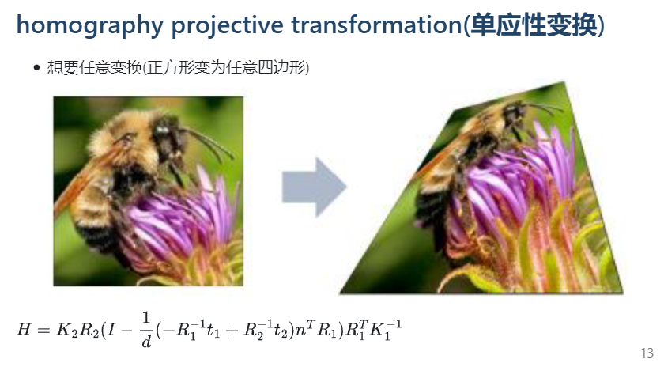
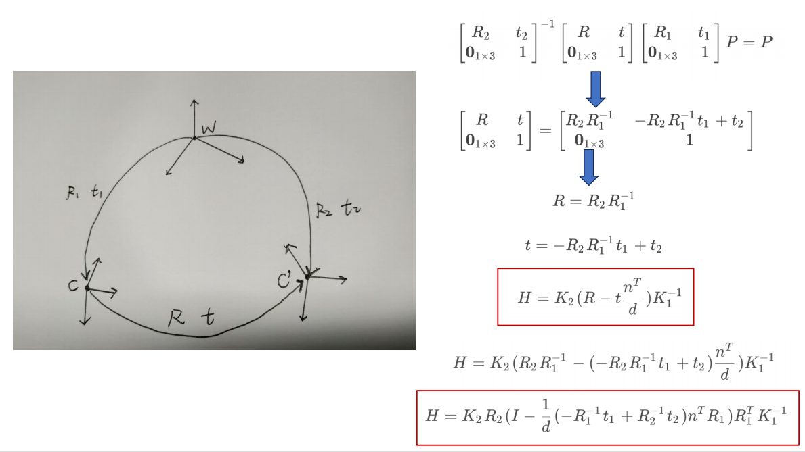
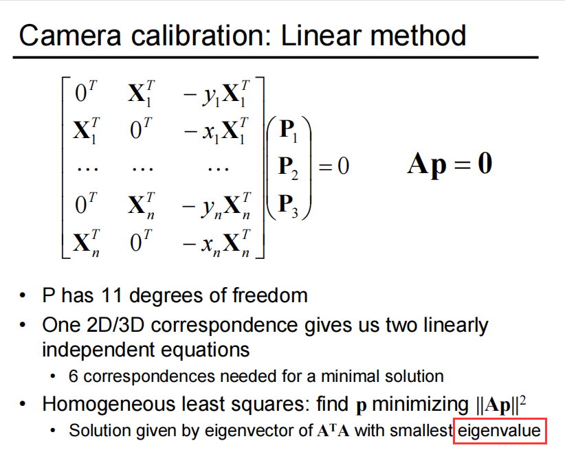

# linear algebra in CS

> 你们觉得你们现在学的东西没有用，并不是因为它真的没有用，只是你们还没有遇到要用到那门课的时候

---

- 一个CS的学生, 在大学期间其实会多次重新学习线性代数

- 学习过的内容不需要你牢牢记住, 但是需要你知道它的存在, 以及它的用途, 以及清楚的知道你需要的时候去哪里找

---

---

- for algorithm and data structure / information theory

e.g. the Laplacian matrix of a graph

---

- for probability and statistics

---

- for machine learning(ML)

---

- for optimization

---

- for computer graphics(CG)

---

- for computer vision(CV)

---

- for computer vision(CV)

---

- for computer vision(CV)

---

- for natural language processing(NLP)
- for robotics
- for data mining
- for data science
$\vdots$