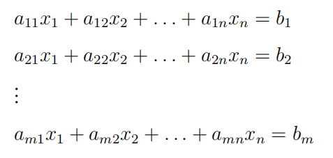
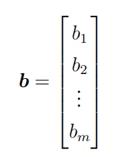
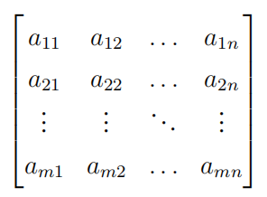
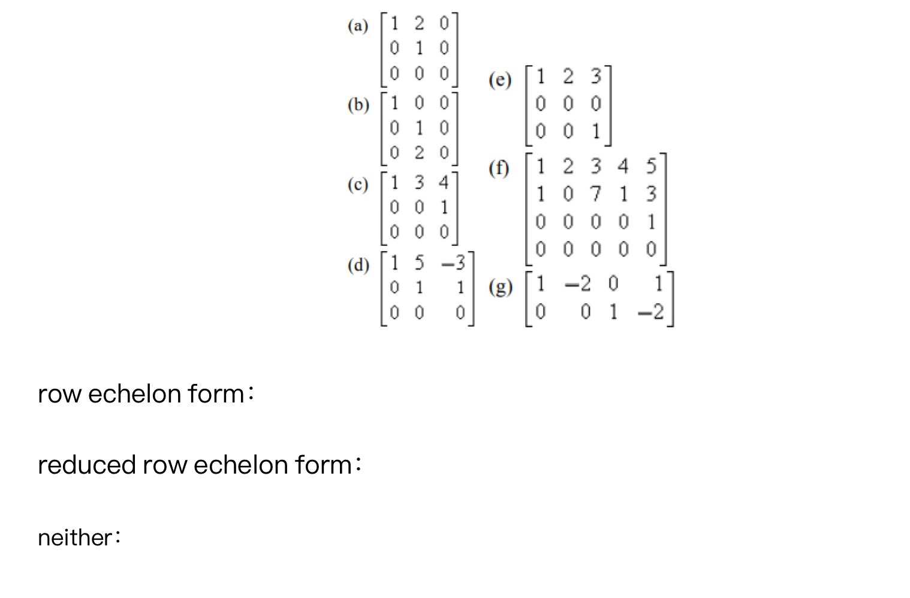
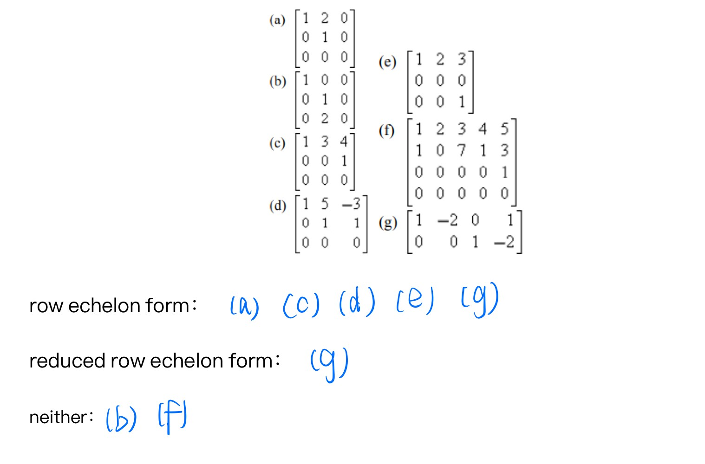
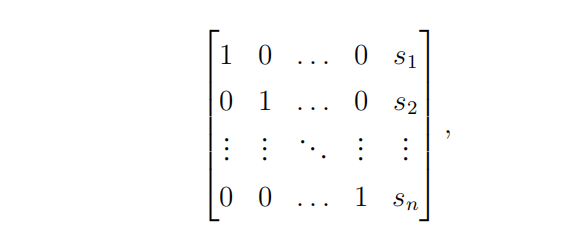
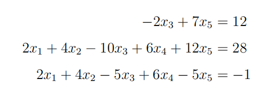
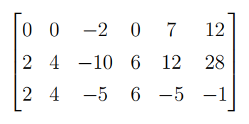
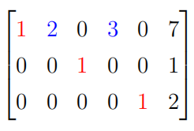
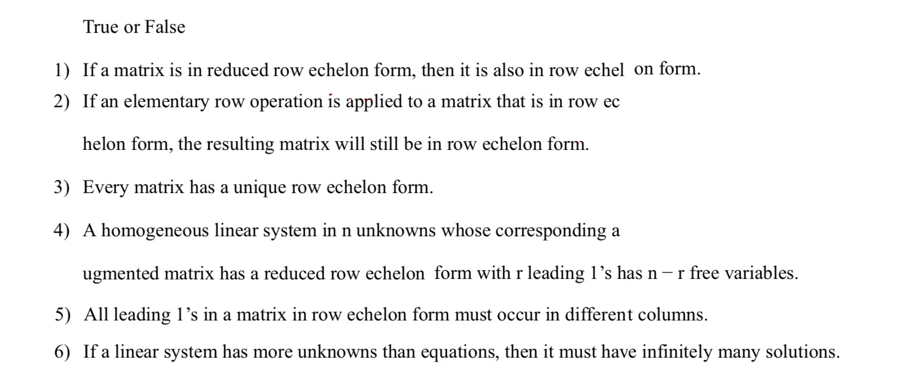

# Linear Algebra Tutorial 1
2023.10.??

---

# self introduction

- 周守琛
- 2021 cs undergraduate
- qq: 1354038619
- email: zhoushch@shanghaitech.edu.cn
---

# About the tutorial
- time: Every :00
- place: SIST 1-??? 

1. hand out homework
  grade distribution:
  平时成绩 30%； 期中考试30%；期末考试 40%
2. some discussion(please post your questions before the tutorial)
3. why in English?

---

# About academic integrity

- No Plagiarism
- No Plagiarism
- No Plagiarism

着重强调学术诚信问题, 禁止抄袭!
鼓励讨论交流
feel free to contact TAs

---

# Why Linear Algebra?

- Linear algebra is the study of vectors and linear transformations.
- It is a fundamental mathematical subject with applications in many fields.
- It is a prerequisite for many other courses.
- ...

---

# What is Linear
- linearity = additivity + homogeneity

1. additivity
  f(x+y) = f(x) + f(y)
2. homogeneity
  f(ax) = af(x)

- more properties will be introduced later(chapter 4  Linear Spaces)

- In this cource, we will mostly focus on linear spaces and linear transformations.

---

# Linear equation(s)

---

# supplement

### (column) vector

- also an $m\times 1$ matrix 

---
# coeffcient matrix & augmented matrix
 

coeffcient matrix $A$ and augmented matrix $\bar{A}=(A|\mathbf{b})$

- specific: $\vec{b} = \vec{0}$:
called **homogeneous linear system**
  1. at least a **trivial solution**
  2. may have non-trivial solutions(linear independence) 

---

# elementary row operations
- multiply a row by a nonzero constant
- add a multiple of one row to another row
- interchange two rows

---

# row echelon form & reduced row echelon form

1. 该矩阵中任何不为0的行里所包含的第一个非零的项都是1。我们称这样的项
为主主主1 (leading 1);
2. 该矩阵中任何为0的行一定在不为0的行的下方;
3. 对于该矩阵中任意两个相相相邻邻邻且不不不为为为0的行，上上上面面面的行里所包含的主主主1一定位
于下下下面面面的行里所包含的主1的左左左侧侧侧;
那么该矩阵被称为阶阶阶梯梯梯型型型(row echelon form)。若一个阶阶阶梯梯梯型型型额外满足以下条件

该矩阵中任何不为0的行里所包含的主主主1是其所在的列列列里唯一一个不为0的
项，
那么该矩阵被称为简化阶梯型
(reduced row echelon form)

---

---

---

我们将把一个线性方程组对应的增广矩阵通过一系列初等行变换转化为阶梯
型的过程称之为高斯消元法 (Gauss elimination)，把一个线性方程组对应的增广
矩阵通过一系列初等行变换转化为简化阶梯型

---
若m = n, 即方程个数与未知数个数相等，且通过对增广矩阵B = (A, b)进行
一系列初等行变换操作后得到以下形状的(增广)矩阵 ˜B =

那么该方程组具有唯一的一组解x1 = s1, x2 = s2, . . . , xn = sn。这里我们
把 ˜B记为 ˜B = (In, s), In被称为n × n–单位矩阵，它的对角线上所有元素均
为1，其他不在对角线上的元素均为0; 列向量s = (s1, . . . , sn)是方程的解

因此，从现在开始，我们可以把对线性方程组 (m = n) 的消元求解过程转化为如
何通过一系列初等行变换将其对应的增广矩阵B = (A, b)转化为 ˜B = (In, s)的过
程，此时s即为方程组的唯一解。特别地，我们现在操作的对象由方程组变为矩
阵。

在结束本节之前，我们需要注意到另一个非常重要的问题: 并非所有线性方程
组对应的增广矩阵都可以通过初等行变换转为 ˜B = (In, s)的形式！ 比如当方程个
数m与未知数个数n不相等时，原增广矩阵B无法变成 ˜B = (In, s)的形式 (为什么？
)；同时，即使m = n，一些线性方程组的增广矩阵依然不能通过初等行变换转
为 ˜B = (In, s)的形式

我们可以把对线性方程组 (m = n) 的消元求解过程转化为如何通过一系列初
等行变换将其对应的增广矩阵B = (A, b)转化为 ˜B = (In, s)的过程。此时向
量s给出方程的唯一解。
• 并非所有方程组的增广矩阵B都可以通过一系列初等行变换转化为 ˜B = (In, s)的
形式。
• 一个线性方程组的增广矩阵B通过一系列初等行变换所转化成的某种“最终
形态”决定了该方程组是否有解，以及解是否唯一

---

# some possible solutions
1. no solution
2. fixed solution
3. infinite solutions

- specific
  trivial solution: $\vec{x} = \vec{0}$

---
general solution
specific solution + trivial solution

Ax=b
通解可由一个特解加上齐次方程的通解得到

---

---

假设B是一个线性方程组的增广矩阵，其对应的阶梯型 ˜B或者简化
阶梯型R里不为0的行里所包含的主1所对应的未知数被称为该方程组的主元 (leading variable)，主元之外的所有未知数被称为该方程组的自由元 (free variable)

---

我们将
x1 = 7 − 3r − 2s, x2 = s, x3 = 1, x4 = r, x5 = 2; r, s 为任意常数
这样的表示称为方程组的通解

假如存在某个i ∈ {1, . . . , m}使得矩阵U的第i行为0，而列向量s的第i个坐
标si ̸= 0，那么该方程组无解。反之该方程组至少有一个解。
• 如果矩阵U = In为n × n-单位矩阵，那么该方程组有且只有一组解，这个解
就是向量s。
• 若方程有解，且U ̸= In，那么该方程组有无穷多组解。

---

---

> TFFTTF

---

# Some useful resources

- 3B1B Essence of Linear Algebra
  直接在B站搜 3b1b线性代数的本质 即可