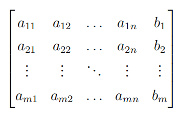
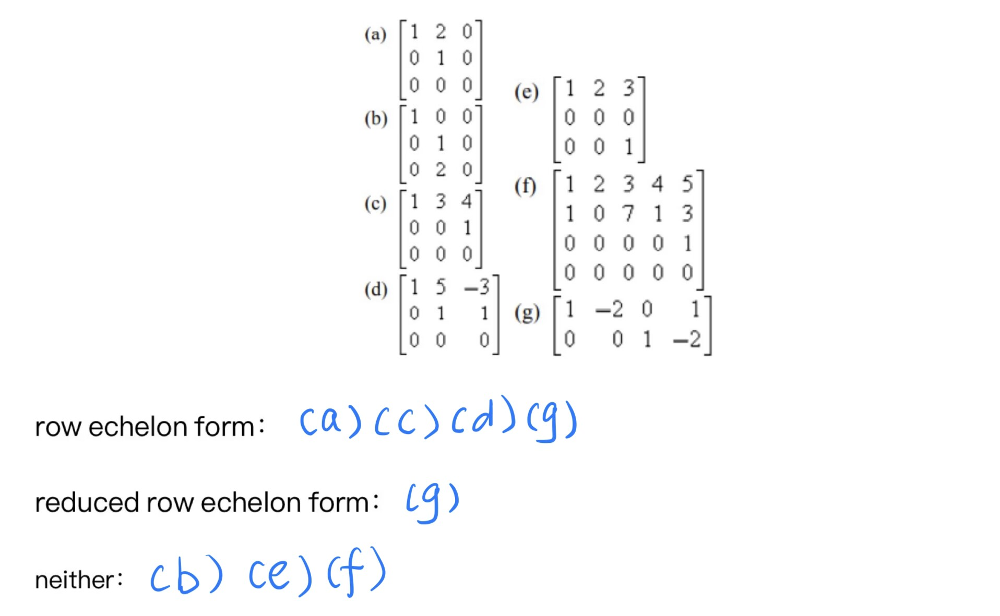

# Linear Algebra Tutorial 1
2023.10.10

---

# self introduction

- 周守琛
- 2021 cs undergraduate
- qq: 1354038619
- email: zhoushch@shanghaitech.edu.cn

---

# About the tutorial
- time: Every Tuesday 18:00
- place: SIST 1A-106

1. ~~hand out homework~~
  grade distribution:
  平时成绩 30%； 期中考试30%；期末考试 40%
2. some discussion(please post your questions before the tutorial)
3. why in English?

---

---

# About academic integrity

- No Plagiarism
- No Plagiarism
- No Plagiarism

着重强调学术诚信问题, 禁止抄袭!
鼓励讨论交流
feel free to contact TAs

---

# Why Linear Algebra?

- Linear algebra is the study of vectors and linear transformations.
- It is a fundamental mathematical subject with applications in many fields.
- It is a prerequisite for many other courses.
- ...

---

# for everyone
- mathmatic anylisis
- probability and statistics
- ...

---

# for cs students

from _**Introduction to Machine Learning**_'s tutorial1

---

# What is Linear
- linearity = additivity + homogeneity

1. additivity
  f(x+y) = f(x) + f(y)
2. homogeneity
  f(ax) = af(x)

- more properties will be introduced later(chapter 4  Linear Spaces)

- In this cource, we will mostly focus on linear spaces and linear transformations.

---

# Linear equation(s)

---

# supplement

### (column) vector

- also an $m\times 1$ matrix 

---
# coeffcient matrix & augmented matrix
 

coeffcient matrix $A$ and augmented matrix $\bar{A}=(A|\mathbf{b})$

- specific: $\vec{b} = \vec{0}$:
called **homogeneous linear system**
  1. at least a **trivial solution**
  2. may have non-trivial solutions(linear independence) 
  > one non-trivial solution $\Rightarrow$ infinite non-trivial solutions

---

# elementary row operations
- multiply a row by a nonzero constant
- add a multiple of one row to another row
- interchange two rows

---

# row echelon form & reduced row echelon form

## row echelon form
- leading 1
- Any row in the matrix that is 0 must be below the row that is not 0
- upper row's leading 1 must be to the left of the lower row's leading 1

## reduced row echelon form

- The leading 1 contained in any row of the matrix that is not 0 is the only term in the column that is not 0

---

---

---

# Gauss elimination

- if $m=n$
  i.e. unknowns = equations

  if the agumented matrix can be transformed into the form of above then the solution is unique

- if $m\neq n$?

---

# some possible situations
1. no solution
2. fixed solution
3. infinite solutions
4. general solution
5. specific solution

- specific
  trivial solution: $\vec{x} = \vec{0}$

- usage
eg. $Ax=b$
      general solution = specific solution + non-trivial solutions(homogeneous)

---

# leading variable & free variable

$B$ is an augmented matrix of a linear system, its row echelon form is $\tilde{B}$

The unknowns corresponding to the leading 1 in the rows that are not 0 in $\tilde{B}$ are called the **leading variables** of the system of equations, and all the unknowns other than the leading variables are called the **free variables** of the system of equations.

---

---

general solutions:

$x_1 = 7 − 3r − 2s, x_2 = s, x_3 = 1, x_4 = r, x_5 = 2$

$r, s\in \mathbb{R}$

---

# example for format

---

---

> TFFTTF

---

# Some useful resources

- 3B1B Essence of Linear Algebra
 youtube or bilibili