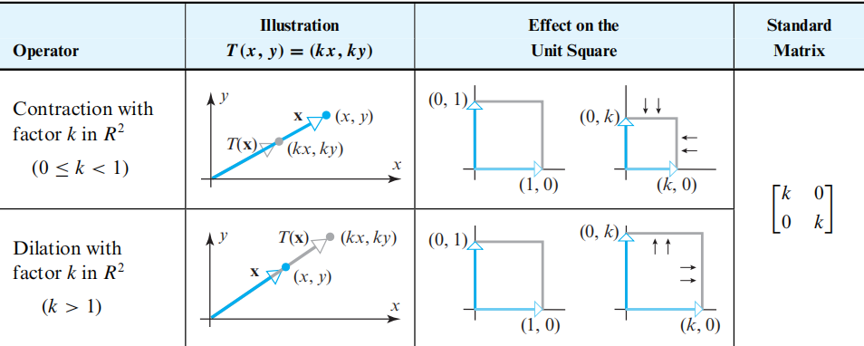

# Linear Algebra Tutorial 10
2023.12.12

---

# mid-term

---

# mid-term

$V$ is **vectoe space**

- $x + (-x) = 0$
  $-x = (-x_1, -x_2)$
  $x+(-x) = (x_1-2x_1, x_2-3x_2)\neq 0$

---

# Matrix transformation

https://www.bilibili.com/video/BV1ys411472E?p=4&vd_source=6b1c6ae9b58bc4261b8429b79364410d

- method : 推出$(x,y,z)$变换后的坐标$(x',y',z')$
  即可得到变换矩阵

---

# Reflection on $\mathbb{R}^2$ 

---

# Reflection on $\mathbb{R}^3$

----

# orthogonal projection on $\mathbb{R}^2$

> projection operation : the rank of the matrix is not full $\Rightarrow$ dimension reduction

---

# orthogonal projection on $\mathbb{R}^3$

---

# rotation on $\mathbb{R}^2$

> for the rotation matrix $R$ , $R^T = R^{-1}$, i.e. $RR^T = I$(orthogonal matrix)

> without scaling, i.e. $|R| = 1$

> the rotation is counterclockwise 默认是逆时针旋转了$\theta$

---

# rotation on $\mathbb{R}^3$

> notice the difference of $y$ axis

---

# Euler angle

rotation clockwise around $x$ axis **pitch** ($\alpha$), around $y$ axis **roll**($\beta$), around $z$ axis **yaw**($\gamma$)

$\begin{bmatrix}x'\\y'\\z'\end{bmatrix}=
\begin{bmatrix}\cos\gamma&-\sin\gamma&0\\\sin\gamma&\cos\gamma&0\\0&0&1\end{bmatrix}
\begin{bmatrix}\cos\beta&0&\sin\beta\\0&1&0\\-\sin\beta&0&\cos\beta\end{bmatrix}
\begin{bmatrix}1&0&0\\0&\cos\alpha&-\sin\alpha\\0&\sin\alpha&\cos\alpha\end{bmatrix}
\begin{bmatrix}x\\y\\z\end{bmatrix}$

> 注意变换的顺序, 从右往左
若改变旋转的顺序, 则变换矩阵也要改变(结果不同)

---

# Dilations(扩张) and Contractions(收缩) on $\mathbb{R}^2$

---

# Dilations(扩张) and Contractions(收缩) on $\mathbb{R}^3$

---

# Expansions(拉伸) and Compressions(压缩)

---

# shear 推移
