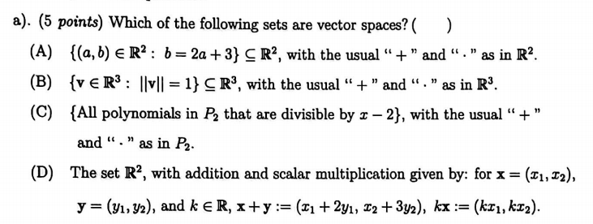
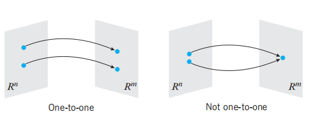
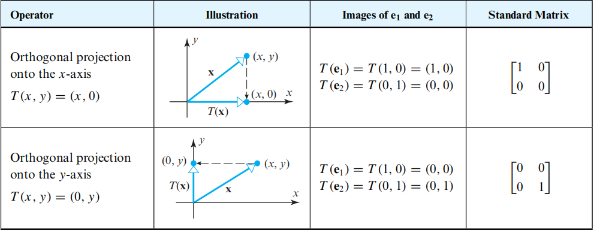

# Linear Algebra Tutorial 10
2023.12.12

---

# mid-term
distribution?

---

# mid-term

---

# mid-term

$V$ is **vectoe space**

- $x + (-x) = 0$
  $-x = (-x_1, -x_2)$
  $x+(-x) = (x_1-2x_1, x_2-3x_2)\neq 0$

---

# linearty 线性
$T: U\to V$ linear transform: 线性变换
- additivity 可加性
  $T(\mathbf{x}+\mathbf{y})=T(\mathbf{x})+T(\mathbf{y})$
- homogeneity 齐次性
  $T(k\mathbf{x})=kT(\mathbf{x})$

> $T$ 可看作是一个函数$f$, 所做的操作是将$\mathbf{x}$映射到$T(\mathbf{x}),(\mathbf{x}\to A\mathbf{x})$

---

# Matrix transformation
- mutiplication of matrix and vector is a linear transformation

- $A = [T] = [T(\mathbf{e}_1), T(\mathbf{e}_2), \cdots, T(\mathbf{e}_n)]$
  $A$: the standard matrix of $T$

>复合函数(composition) $f(g(x))$ 也可写作 $(f\circ g)(x)$
> 同理: $(T_2\circ T_1)(\mathbf{x}) = [T_2][T_1](\mathbf{x})$
---

# concepts

- image 像 $\Leftrightarrow$ range 值域
- mapping 映射

---
# concepts

- domain 定义域
  {Adams, Chou, Goodfriend, Rodriguez, Stevens}
- codomain 陪域
  ${A, B, C, D, F}$
- range 值域
  ${A, B, C, F}$
- 定义域是映射的集合, 值域是**被**映射**到**的集合, 陪域是**可被**映射到的集合
值域是陪域的子集

---

# concepts

- kernel 核
  $Ker(T) = \{\mathbf{x} \in V | T(\mathbf{x}) = \mathbf{0}\}$
  $Ker(T) \Leftrightarrow Null(A)$

- range 值域
  $RAN(T) = \{\mathbf{y} \in W | \mathbf{y} = T(\mathbf{x}), \mathbf{x} \in V\}$
  $RAN(T) \Leftrightarrow Col(A)$

---

# concepts
- injective 单射
  $f(x_1) = f(x_2) \Rightarrow x_1 = x_2$

- surjective(onto) 满射
  $\forall y \in Y, \exists x \in X, s.t. f(x) = y$

- bijective(one-to-one) 双射(一一映射)
  injective + surjective
  > 只有一一映射才存在逆映射(反函数)

---

# Matrix transformation

https://www.bilibili.com/video/BV1ys411472E?p=4&vd_source=6b1c6ae9b58bc4261b8429b79364410d

- method : 推出$(x,y,z)$变换后的坐标$(x',y',z')$
  即可得到变换矩阵

---

# Reflection on $\mathbb{R}^2$ 

---

# Reflection on $\mathbb{R}^3$

----

# orthogonal projection on $\mathbb{R}^2$

> projection operation : the rank of the matrix is not full $\Rightarrow$ dimension reduction

---

# orthogonal projection on $\mathbb{R}^3$

---

# rotation on $\mathbb{R}^2$

> for the rotation matrix $R$ , $R^T = R^{-1}$, i.e. $RR^T = I$(orthogonal matrix)

> without scaling, i.e. $|R| = 1$

> the rotation is counterclockwise 默认是逆时针旋转了$\theta$

---

# rotation on $\mathbb{R}^3$

> notice the difference of $y$ axis

---

# Euler angle

rotation clockwise around $x$ axis **pitch** ($\alpha$), around $y$ axis **roll**($\beta$), around $z$ axis **yaw**($\gamma$)

$\begin{bmatrix}x'\\y'\\z'\end{bmatrix}=
\begin{bmatrix}\cos\gamma&-\sin\gamma&0\\\sin\gamma&\cos\gamma&0\\0&0&1\end{bmatrix}
\begin{bmatrix}\cos\beta&0&\sin\beta\\0&1&0\\-\sin\beta&0&\cos\beta\end{bmatrix}
\begin{bmatrix}1&0&0\\0&\cos\alpha&-\sin\alpha\\0&\sin\alpha&\cos\alpha\end{bmatrix}
\begin{bmatrix}x\\y\\z\end{bmatrix}$

> 注意变换的顺序, 从右往左
若改变旋转的顺序, 则变换矩阵也要改变(结果不同)

---

# Dilations(拉伸) and Contractions(收缩) on $\mathbb{R}^2$

---

# Dilations(拉伸) and Contractions(收缩) on $\mathbb{R}^3$

---

# Expansions(拉伸) and Compressions(压缩)

---

# shear 推移
