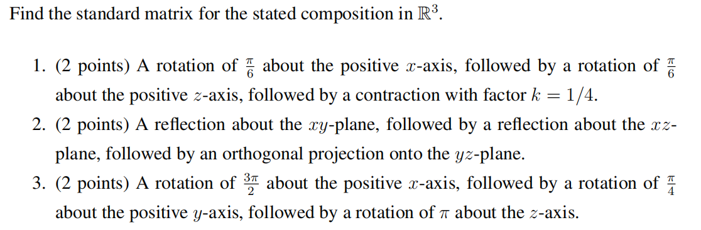
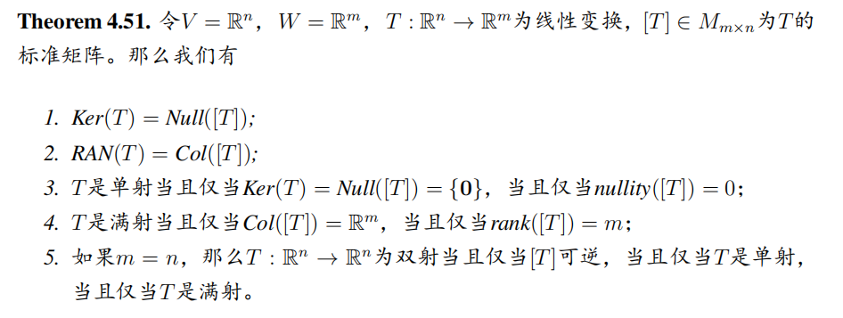
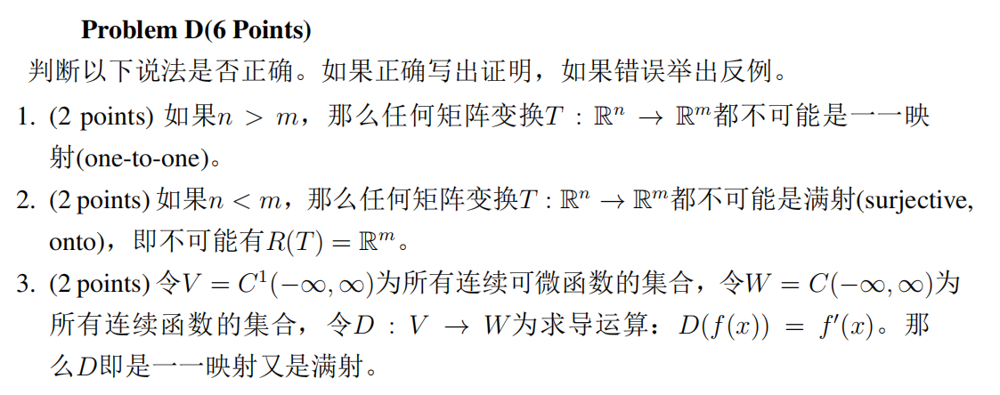
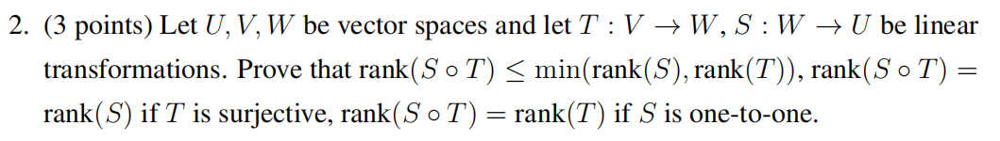
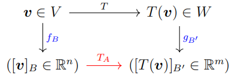
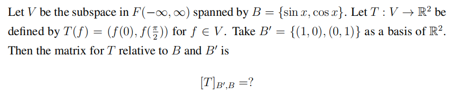

# Linear Algebra Tutorial 11
2023.12.19

---

# homework

---

# theorem

---

# homework

- 如果 $\dim(V) > \dim(W)$,那么$T$必然不可能是一一映射.
- 如果 $\dim(V) < \dim(W)$,那么$T$必然不可能是满射.

---

# homework

$E$

---

- one-to-one $\Leftrightarrow$ injective
$f(x_1) = f(x_2) \Rightarrow x_1 = x_2$
  > 只有一一映射才存在逆映射(反函数)
$T:V\to W$ is one-to-one $\Leftrightarrow T^{-1}$ exists
$T^{-1}: R(T)\to V$

- onto
    $T:V\to W$ is onto $\Leftrightarrow R(T) = W$

- sujective = injective + onto

---

# Linear transformation
$T:V\to W$ is linear transformation

- Kernel
  $Ker(T): \{v\in V|T(v) = 0\}$
  $Ker(T)\subseteq V$ is a subspace of $V$
  $Ker(T)\Leftrightarrow Null([T])$

- range
  $RAN(T) / R(T): \{w\in W|w = T(v), v\in V\}$
  $R(T) \subseteq W$ is a subspace of $W$
  $R(T) \Leftrightarrow Col([T])$

- $\dim(Ker(T)) + \dim(R(T)) = \dim(V)$

---

# Isomorphism (同构)
- $T:V\to W$ is bijective linear transformation
双射的线性变换

- 则称$T$是一个同构 (isomorphism)
- $V$ 和 $W$ 是同构的 (isomorphic)
- $V$ 和 $W$ 是同构的 $\Leftrightarrow \dim(V) = \dim(W)$

---

# Isomorphism (同构)
prove $T:V\to W$ is isomorphism:
- $T$ is linear transform
  $T(\mathbf{u}+\mathbf{v})=T(\mathbf{u})+T(\mathbf{v})$
  $T(k\mathbf{u})=kT(\mathbf{u})$
- $T$ is bijective(双射)
  injective(单射/一一映射) + onto(满射)

$\forall V$, if $\dim(V)=n\Rightarrow V,\mathbb{R}^n$ are isomorphic

---

# Isomorphism (同构)
$T:V\to W$ is a linear transformation, $\dim(V) = \dim(W)=n$
equivalent statements:
- $T$ is injective
- $T$ is onto
- $T$ is isomorphism
- $Ker(T) = \{\mathbf{0}\}$
- $R(T) = W$

> $n =\dim(V ) = rank(T) + nullity(T)$.

---

# Inverse Transformations(逆映射)
$T:V\to W$ is a linear transformation, and $T$ is injective/one-to-one (单射/一一映射)
那么存在一个逆映射 $T^{-1}:R(T)\to V$ 使得
- $T(\mathbf{v}) = \mathbf{w} \Leftrightarrow T^{-1}(\mathbf{w}) = \mathbf{v}$
- $(T^{-1}\circ T)(\mathbf{v}) = \mathbf{v}, \mathbf{v}\in V$
- $(T\circ T^{-1})(\mathbf{w}) = \mathbf{w}, \mathbf{w}\in R(T)$
- $T^{-1}$ is linear transformation, $T^{-1}$ is onto and $T^{-1}$ is one-to-one
  So $R(T), V$ are isomorphic

---

# Inverse Transformations(逆映射)
$T_1:U\to V$ and $T_2:V\to W$ are injective
- $T_2\circ T_1$ is injective
- $(T_2\circ T_1)^{-1}: R(T_2\circ T_1)\to U$ has inverse transformation
  $(T_2\circ T_1)^{-1} = T_1^{-1}\circ T_2^{-1}$

---

# Matrices for general linear transformations 
(线性变换的矩阵表示)

- $f_B$: 将$\mathbf{v}$转换成以$B$为基的坐标
- $g_{B'}$: 将$T(\mathbf{v})$转换成以$B'$为基的坐标
- $T_A$: $\mathbb{R}^n\to\mathbb{R}^m$的线性变换

$T_A(\mathbf{x})=A\mathbf{x}$, s.t. $[T(\mathbf{v})]_{B'}=A[\mathbf{v}]_{B}=[T]_{B',B}[\mathbf{v}]_{B}$

---

# Matrices for general linear transformations

为$T$关于基底$B$与$B'$的矩阵表示 
(The matrix for $T$ relative to $B$ and $B'$)

$T_A\Rightarrow [T]_{B',B}$
$B=\{\mathbf{v}_1,\mathbf{v}_2,\cdots,\mathbf{v}_n\}$, $B'=\{\mathbf{w}_1,\mathbf{w}_2,\cdots,\mathbf{w}_m\}$

$[T_A(\mathbf{v})]_{B'}=[T]_{B',B}[\mathbf{v}]_{B}$

$[T]_{B',B}=[[T(\mathbf{v}_1)]_{B'}\ \cdots\ [T(\mathbf{v}_n)]_{B'}]$

---

# Matrices for general linear transformations
