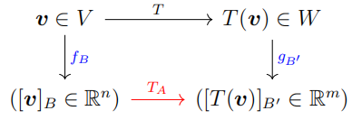
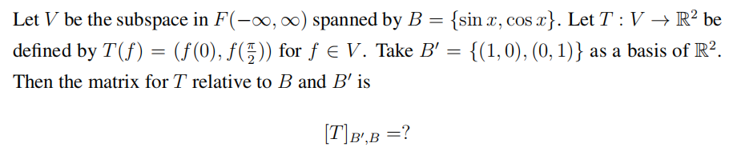
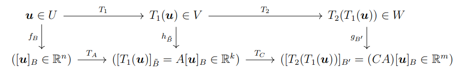
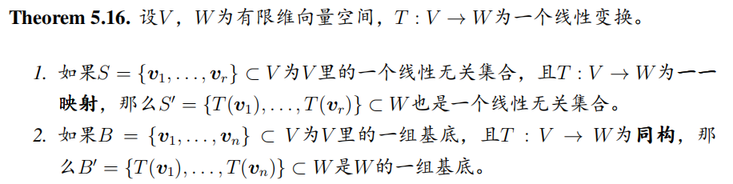
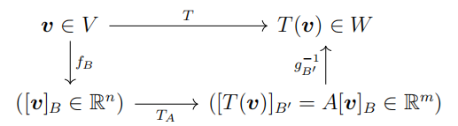
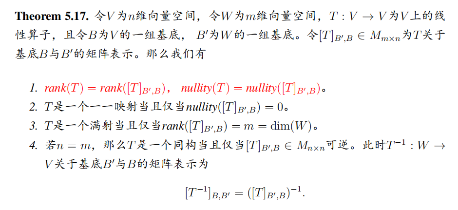
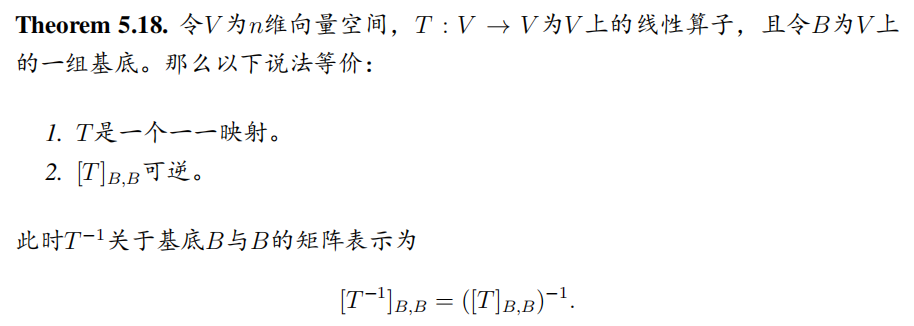
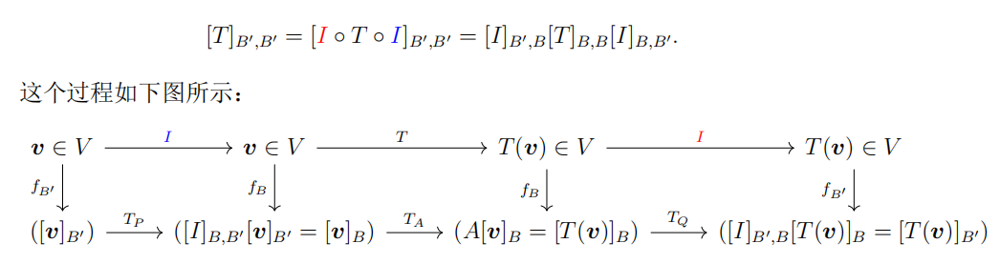
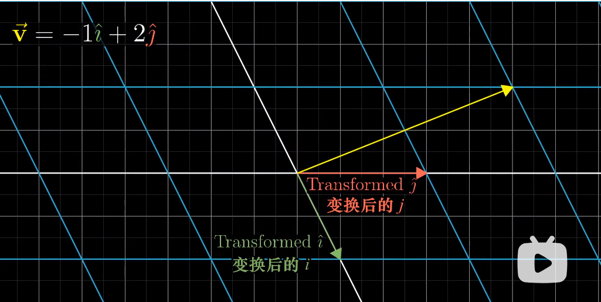
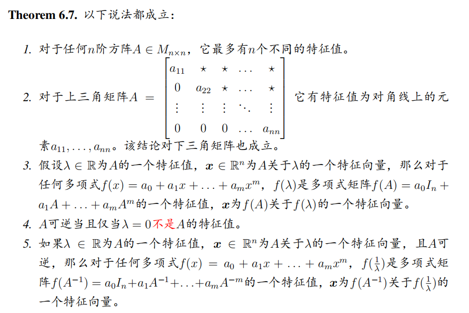

# Linear Algebra Tutorial 12
2023.12.26

---

# homework

---

# 线性变换的矩阵表示
Matrices for general linear transformations

为$T$关于基底$B$与$B'$的矩阵表示 
(The matrix for $T$ relative to $B$ and $B'$)

$[T]_{B',B}=[[T(\mathbf{v}_1)]_{B'}\ \cdots\ [T(\mathbf{v}_n)]_{B'}]$
$[T(\mathbf{v})]_{B'}=[T]_{B',B}[\mathbf{v}]_{B}$

---

# Matrices for general linear transformations

为$T$关于基底$B$与$B'$的矩阵表示 
(The matrix for $T$ relative to $B$ and $B'$)

$T_A\Rightarrow [T]_{B',B}$
$B=\{\mathbf{v}_1,\mathbf{v}_2,\cdots,\mathbf{v}_n\}$, $B'=\{\mathbf{w}_1,\mathbf{w}_2,\cdots,\mathbf{w}_m\}$

$[T_A(\mathbf{v})]_{B'}=[T]_{B',B}[\mathbf{v}]_{B}$

$[T]_{B',B}=[[T(\mathbf{v}_1)]_{B'}\ \cdots\ [T(\mathbf{v}_n)]_{B'}]$

- $rank(T) = rank([T]_{B′,B}), nullity(T) = nullity([T]_{B′,B})$

- $[T^{-1}]_{B,B'}=([T]_{B',B})^{-1}$

---

# Matrices for general linear transformations

---

# composition of linear transformations

$T_1:U\to V, T_2:V\to W$
$[T_2\circ T_1]_{B',B}=[T_2]_{B',B''}[T_1]_{B'',B}$
> cancel the nearest basis(B'')

---

---

# inverse of linear transformations

$[T^{-1}]_{B,B'}=([T]_{B',B})^{-1}$

---

# property

T是一个一一映射 $\Leftrightarrow$ $[T]_{B',B}$ 可逆

---

# theorem

- $[T]_{B,B} = [T]_B$
- $[T]_{B',B'} = [T]_{B'}$

---

# 相似矩阵 Similarity

$T:V\to V$是一个线性变换,
$B$是$V$的一个基底, $A=[T]_{B,B}$: $T$关于$B$的矩阵表示
$V$的另一组基底$B'$, $A'=[T]_{B',B'}$: $T$关于$B'$的矩阵表示

- $[T]_{B',B'}=(P_{B\leftarrow B'})^{-1}[T]_{B,B}P_{B\leftarrow B'}$

---

- $[T]_{B',B'}=(P_{B\leftarrow B'})^{-1}[T]_{B,B}P_{B\leftarrow B'}$

explaination

> 1. 以$B'$为基的坐标转成以$B$为基的坐标
> 2. 以$B$为基的坐标进行线性变换
> 3. 以$B$为基的坐标转成以$B'$为基的坐标

---

# Similarity
$B=P^{-1}AP$, then $A$ and $B$ are similar, $A$ is similar to $B$

- 自反性 $A$ is similar to $A$   $(P=I)$
- 对称性 $A$ is similar to $B \Leftrightarrow B$ is similar to $A$
- 传递性 $A$ is similar to $B$, $B$ is similar to $C$, then $A$ is similar to $C$

- **矩阵多项式** if $A$ is similar to $B$, then $p(A)$ is similar to $p(B)$
 $p(A)=a_0+a_1A+\cdots+a_nA^n$

> $[T]_{B',B'}=(P_{B\leftarrow B'})^{-1}[T]_{B,B}P_{B'\leftarrow B}$
所以说 $[T]_{B,B}$ 和 $[T]_{B',B'}$ 是相似的

---

# 相似不变量 similarity invariants
$B=P^{-1}AP$

- $|A|=|B|$
- $tr(A)=tr(B)$ 
    (可以通过$tr(A)=\lambda_1+\cdots+\lambda_n$证明)
- $rank(A)=rank(B)$
    $B=P^{-1}AP\Rightarrow rank(B)\leq rank(A)$
    $A=PBP^{-1}\Rightarrow rank(A)\leq rank(B)$
- $nullity(A)=nullity(B)$

---

# 特征值(eigenvalue)与特征向量(eigenvector)
> chapter 5 in the textbook

---

# 特征值(eigenvalue)
$A\mathbf{x}=\lambda\mathbf{x}$
$(\lambda I-A)\mathbf{x}=\mathbf{0}$

$\mathbf{x}\neq\mathbf{0}$
$\big|\lambda I-A\big|=0$

- $p(\lambda)=\big|\lambda I-A\big|$: eigen polynomial 特征多项式
- $p(\lambda)=0$: characteristic equation 特征方程

---

# eigen polynomial 特征多项式
$p(\lambda)=\big|\lambda I-A\big|$
$p(\lambda)$为关于$\lambda$,最高次项为$n$的多项式
$p(\lambda)=(\lambda-\lambda_1)\cdots(\lambda-\lambda_n)=\lambda^n+a_{n-1}\lambda^{n-1}+\cdots+a_1\lambda+a_0$

- let $\lambda=0$, then $p(0)=\big|-A\big|=(-1)^n\lambda_1\cdots\lambda_n=a_0\Rightarrow a_0=(-1)^n|A|$
$|A|=\lambda_1\cdots\lambda_n=(-1)^na_0$

- 由行列式的另一种定义(不同行不同列的元素的积之和), $\lambda_{n-1}$的系数只能由$(\lambda-a_{11})\cdots(\lambda-a_{nn})$产生, 即$a_{n-1}=-(a_{11}+\cdots+a_{nn})$
$tr(A)=a_{11}+\cdots+a_{nn}=-a_{n-1}$

---

# 特征向量(eigenvector)
$A\mathbf{x}=\lambda\mathbf{x}$
$(A-\lambda I)\mathbf{x}=\mathbf{0}$
$\mathbf{x}\neq\mathbf{0}$

- the nontrivial solutions of $(A-\lambda I)\mathbf{x}=\mathbf{0}$
- $\mathbf{x}\in null(A-\lambda I)$
- $\mathbf{x}$ : the eigenvectors(特征向量) of $A$ corresponding to $\lambda$
- $null(A-\lambda I)$ : the eigenspace(特征空间) of $A$ corresponding to $\lambda$

The number of the eigenvectors of $A$ corresponding to $\lambda_i$ is same as the multiplicity of roots of $\lambda_i$ of $p(\lambda)$

---

# eigenvalue and eigenvector
$A=\begin{bmatrix}0&0&-2\\
1&2&1\\
1&0&3\end{bmatrix}$

find the eigenvalues and eigenvectors of $A$

---

# property

---

# example
$A$ is a $2\times 2$ matrix with eigenvalues $\lambda_1,\lambda_2\in\mathbb{Z}$, $B=A^{-2}-6A^{-1}$, the eigenvalues of $B$ are $-5$ and $7$, find $\lambda_1,\lambda_2$

---

# example
$A$ is a $2\times 2$ matrix with eigenvalues $\lambda_1,\lambda_2\in\mathbb{Z}$, $B=A^{-2}-6A^{-1}$, the eigenvalues of $B$ are $-5$ and $7$, find $\lambda_1,\lambda_2$

$\dfrac{1}{\lambda_1^2} - 6\dfrac{1}{\lambda_1} = -5$
$\dfrac{1}{\lambda_2^2} - 6\dfrac{1}{\lambda_2} = 7$

$\lambda_1 = 1, \lambda_2 = -1$

---

# similarity invariants 相似不变量
$B=P^{-1}AP$
- determinant, rank, nullity, trace
- $A$,$B$有相同的特征多项式(eigen polynomial)
    $|\lambda I-B|=|\lambda P^{-1}IP- P^{-1}AP|=|P^{-1}(\lambda I-A)P|=|\lambda I-A|$ 
- $A$,$B$有相同的特征值(eigenvalues)
- $A$,$B$ 特征空间的**维度数**相同,特征空间不一定相同

---

# similarity
$B=P^{-1}AP$
- $A,B$ 有相同的eigenvalues $\lambda$
- 若$\mathbf{x}$是$A$的eigenvector, 则$P^{-1}\mathbf{x}$是$B$的eigenvector
- 若$\mathbf{y}$是$B$的eigenvector, 则$P\mathbf{y}$是$A$的eigenvector

---

# (相似)对角化 Diagonalization
若一个矩阵$A$可写作$D=P^{-1}AP$,即$A=PDP^{-1}$, 则称$A$可对角化(diagonalizable)

usage:
$A^n=PDP^{-1}PDP^{-1}\cdots PDP^{-1}=PD^nP^{-1}$

---

# Diagonalization
e.g. $A=\begin{bmatrix}1&1\\-2&4\end{bmatrix}$, find $A^n$

思路: 将$A$对角化, $A=PDP^{-1}$, $A^n=PD^nP^{-1}$

1. 求$A$的特征值和特征向量
2. 将特征向量组成$P$
原因: $A=PDP^{-1}\Leftrightarrow AP=PD$

$D$: 特征值
$P$: 特征空间的基拼成(对应特征值)

$P=\begin{bmatrix}1&1\\-2&4\end{bmatrix}$, $D=\begin{bmatrix}2&0\\0&3\end{bmatrix}$

---

# Diagonalization

可对角化: 对于一个有着$k$重根的特征值, 其特征空间的维度也为$k$

即能找到$n$个线性无关的特征向量

- 若 $A \in M_{n\times n}$拥有$n$个不同的特征值，那么$A$可对角化
    每个特征值至少有一个对应的特征向量

- 不同特征值的对应的特征向量线性无关

- $A$的任何一个特征值$\lambda$, 几何重数(geometric multiplicity)(特征空间的维度) $\leq$ 代数重数(algebraic multiplicity)($\lambda$的重数)

---

# property

- **对称矩阵**不同特征值对应的特征向量彼此正交
    设$\lambda_1\neq \lambda_2$, 其对应的特征向量为$\mathbf{x}_1,\mathbf{x}_2$
    $A\mathbf{x}_1=\lambda_1\mathbf{x}_1,A\mathbf{x}_2=\lambda_2\mathbf{x}_2$
    $\mathbf{x}_1^{\top}A\mathbf{x}_2=\mathbf{x}_1^{\top}\lambda_2\mathbf{x}_2=\lambda_2\mathbf{x}_1^{\top}\mathbf{x}_2$
    $(A\mathbf{x}_1)^{\top}\mathbf{x}_2=(\lambda_1\mathbf{x}_1)^{\top}\mathbf{x}_2$
    $(\lambda_2-\lambda_1)\mathbf{x}_1^{\top}\mathbf{x}_2=x_1^{\top}A\mathbf{x}_2-x_1^{\top}A^{\top}\mathbf{x}_2=0$

- 若将**对称矩阵**的特征向量的基**单位化**得到$P$,则$P$是正交矩阵
    $P^{\top}P=I$

- 实对称矩阵一定可以相似对角化

- $A^{\top}A$的特征值一定都是非负的
    $\forall x, x^{\top}A^{\top}Ax=\|Ax\|^2\geq 0\Leftrightarrow A^{\top}A \succeq 0\Leftrightarrow A^{\top}A$的特征值都是非负的

- 同理, $AA^{\top}$的特征值一定都是非负的

---

# 数列的特征值

e.g. $a_0=a_1=1,a_{n+2}=a_{n+1}+a_n$

$x^2 = x + 1$
$x_1 = \frac{1+\sqrt{5}}{2},x_2 = \frac{1-\sqrt{5}}{2}$
$a_n = c_1x_1^n + c_2x_2^n$
带入$a_0=a_1=1$得到$c_1,c_2$的值
$c_1=\frac{1}{\sqrt{5}},c_2=-\frac{1}{\sqrt{5}}$
所以$a_n = \frac{1}{\sqrt{5}}(\frac{1+\sqrt{5}}{2})^n - \frac{1}{\sqrt{5}}(\frac{1-\sqrt{5}}{2})^n$

---

# 数列的特征值

e.g. $a_0=a_1=1,a_{n+2}=a_{n+1}+a_n$
$$\begin{bmatrix}a_{n+2}\\a_{n+1}\end{bmatrix} = \begin{bmatrix}1&1\\1&0\end{bmatrix}\begin{bmatrix}a_{n+1}\\a_{n}\end{bmatrix}$$
$$\begin{bmatrix}a_{n+2}\\a_{n+1}\end{bmatrix} = \begin{bmatrix}1&1\\1&0\end{bmatrix}^n\begin{bmatrix}a_{1}\\a_{0}\end{bmatrix}$$
对$\begin{bmatrix}1&1\\1&0\end{bmatrix}$做特征值分解:
$\big|\begin{matrix*}1-\lambda&1\\1&-\lambda\end{matrix*}\big| = \lambda^2-\lambda-1=0$

$$\begin{bmatrix}1&1\\1&0\end{bmatrix} = \begin{bmatrix}\frac{1+\sqrt{5}}{2}&\frac{1-\sqrt{5}}{2}\\\frac{1-\sqrt{5}}{2}&\frac{1+\sqrt{5}}{2}\end{bmatrix}\begin{bmatrix}\frac{1+\sqrt{5}}{2}&0\\0&\frac{1-\sqrt{5}}{2}\end{bmatrix}\begin{bmatrix}\frac{1}{\sqrt{5}}&\frac{1}{\sqrt{5}}\\-\frac{1}{\sqrt{5}}&\frac{1}{\sqrt{5}}\end{bmatrix}$$