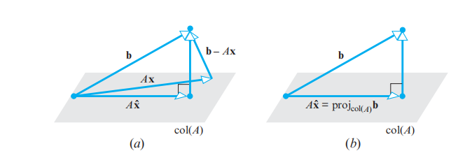
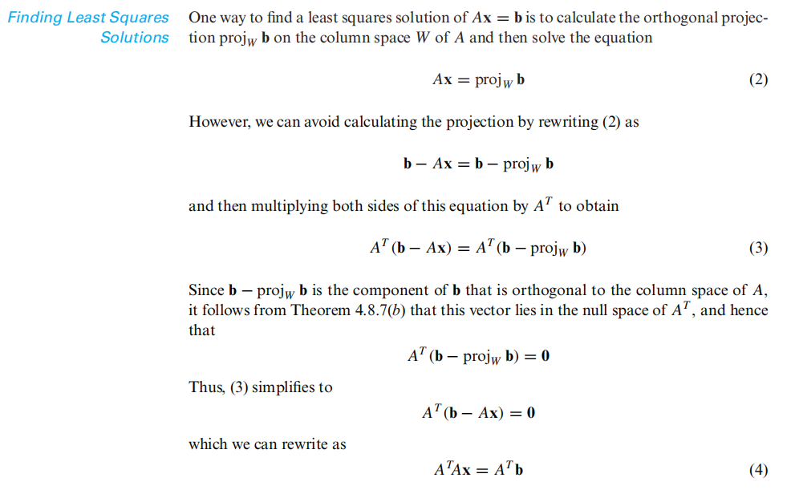

# Linear Algebra Tutorial 14
2024.1.9

---

# Projection Theorem for inner product space

---

# least square approximation*

---
# least square approximation*

---
# least square approximation*
- more intuitive:
$\min\limits_{\mathbf{x}\in\mathbb{R}^n} \mathcal{L} =\big|\big|\mathbf{b}-A\mathbf{x}\big|\big|_2^2$

$\mathcal{L} =\big|\big|\mathbf{b}-A\mathbf{x}\big|\big|_2^2=(\mathbf{b}-A\mathbf{x})^T(\mathbf{b}-A\mathbf{x})=\mathbf{b}^T\mathbf{b}-\mathbf{b}^TA\mathbf{x}-\mathbf{x}^TA^T\mathbf{b}+\mathbf{x}^TA^TA\mathbf{x}$
$\dfrac{\partial\mathcal{L}}{\partial\mathbf{x}}=-2A^T\mathbf{b}+2A^TA\mathbf{x}=0$
$\Rightarrow A^TA\mathbf{x}=A^T\mathbf{b}$

---

# Gram–Schmidt 施密特正交化

---

# Quadratic Forms 二次型

---

# 奇异值分解 Singular Value Decomposition (SVD)