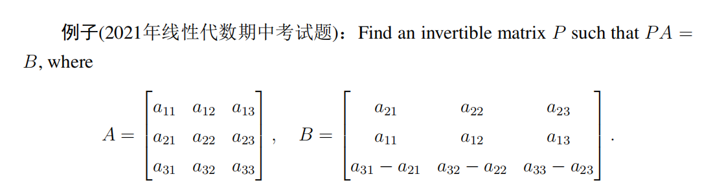

# Linear Algebra Tutorial 
2023.10.17

---

# Matrices

- square matrix
  diagonal
- diagonal matrix
- upper(lower) triangular matrix
- identity matrix
- zero matrix
- symmetric matrix
- skew-symmetric matrix
- orthogonal matrix
- .............
---

# Matrices

- row vector
- column vector

> A matrix can be view as a set of vectors(row/column)

---

# Matrix Operations

- equality
- addition(subtraction)
- scalar multiplication(product)
- matrix multiplication
- division?

---

# some concepts
- linear combination of $A1, A2, \cdots , A_r$ with coefficients $c_1, c_2, \cdots , c_r$

- matrix multiplication can be seen as $AB=A[\mathbf{c_1\ c_2\ \cdots\ c_n}]=[\mathbf{Ac_1\ Ac_2\ \cdots\ Ac_n}]$

- similarly
$AB=[\mathbf{c_1\ c_2\ \cdots\ c_n}]^TB=[\mathbf{Ac_1\ Ac_2\ \cdots\ c_nB}]$
> proof? Try on homework

- the linear equation system can be seen as $\mathbf{Ax=B}$

- $trace(AB) = trace(BA)$
---

# transpose
$(A^⊤)_{ij} = (A)_{ji}$

- $(AB)^T=B^TA^T$
- $AA^T$ must be a symmetric matrix
---
# matrix properties

- the commutative law
  $AB=BA$ if and only if $A$ and $B$ are both diagonal matrices（是真的吗？查一下充要条件）
  最典型的反例就是ABsize不同

---

# polynomial of a matrix

$\begin{aligned}
A=
\left[\begin{array}{cc}-1 & 2 \\ 0 & 3
\end{array}\right]
\end{aligned}$, $p(x)=x^2-2x-3$, find $p(A)$

---

$\begin{aligned}
A=
\left[\begin{array}{cc}-1 & 2 \\ 0 & 3
\end{array}\right]
\end{aligned}$, $p(x)=x^2-2x-3$, find $p(A)$ 

$p(A)=A^2-2A-3I_2=$

$\begin{aligned}
\left[\begin{array}{cc}0 & 0 \\ 0 & 0
\end{array}\right]
\end{aligned}$

---

# Inverses of matrices
- singular matrix $\leftrightarrow$ invertible matrix
$AB = BA = I_n$
$B=A^{-1}$
 otherwise, $A$ is singular and has no inverse
  $(|A|=0)$

  > How about $A_{3\times 4}$?

---

# properties of inverse matrices

- inverse matrix of $A$ is unique
  $B,C$ are $A$'s inverse matrices
  $B=BI_n=B(AC)=(BA)C=I_nC=C$ 

- $(A^{-1})^{-1}=A$
- $(A^T)^{-1}=(A^{-1})^T\to A^{-T}$
> proof: $A^T(A^{-1})^T=(A^TA)^{-1}=I_n$
---

# inverse of a matrix with $2\times 2$
$\begin{aligned}
A=
\left[\begin{array}{cc}a & b \\ c & d
\end{array}\right]
\end{aligned}$, $|A|=ad-bc\neq 0$, find $A^{-1}$

$\begin{aligned}
A^{-1}=\frac{1}{ad-bc}
\left[\begin{array}{cc}d & -b \\ -c & a
\end{array}\right]
\end{aligned}$

> actually, $A^{-1}=\frac{1}{|A|}A^*$, where $A^*$ is the adjugate matrix of $A$

---

# Elementary matrices and a method for finding $A^{−1}$

# important!

> will be proved tomorrow

$E_kE_{k−1}\cdots E_{1}A = I_n$

---

---

# equivalent conditions

- $A$ is a square matrix of order $n$

1. $A$ is invertible
2. homogeneous equation system $Ax=0$ has only trivial solution
3. $A$'s reduced row echolon form is $I_n$
4. $A$ can be expressed as a product of elementary matrices
5. for a $n\times 1$ vector $b$, the equation system $Ax=b$ has a (unique) solution

---

