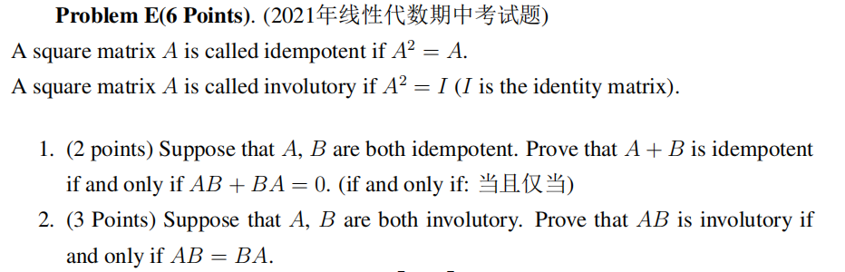
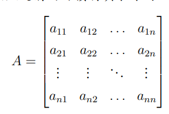
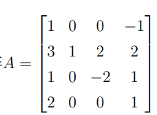
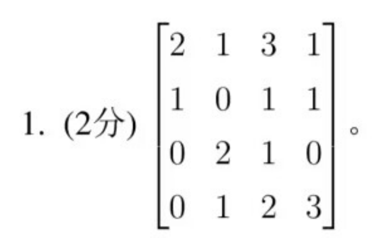
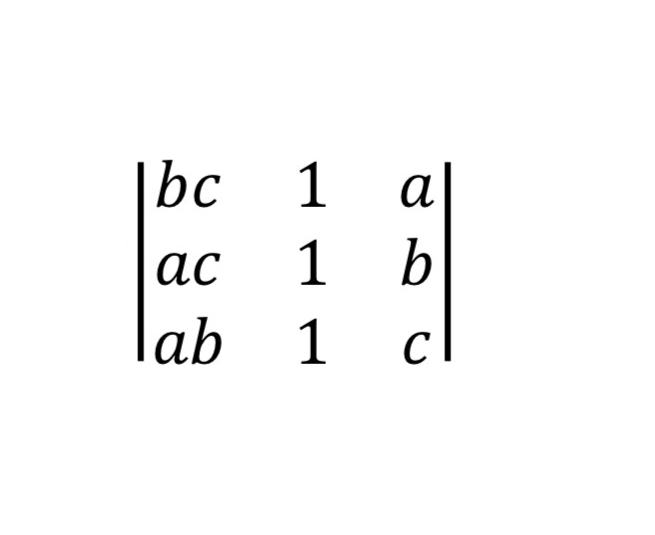
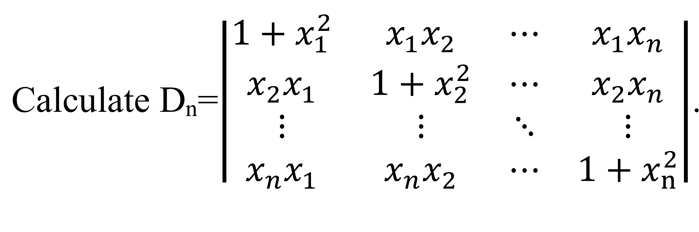

# Linear Algebra Tutorial3
2023.10.24

---

# homework

- please notice that the ddl is **$22:00$**!
- please notice which homework you are handing in

---

# homework

- iff: if and only if
 which means you need to prove both **if** "$\Leftarrow$" and **only if** "$\Rightarrow$"
Or always uses $\Leftrightarrow$

---

- we are mainly talking about the determinant these times, so without announcement, all the matrixes are square matrixes

---

# Diagonal matrices

- for diagonal matrix $D$, $D_{ij} = 0$ for $i \neq j$
so it can be written as $D = diag(d_1, d_2, \cdots, d_n)$

- the power of diagonal matrix is easy to compute
$D^k = diag(d_1^k, d_2^k, \cdots, d_n^k)$
$\to$ similarity and diagonalizable(much later)

- the diagonal matrix $D$ is invertible if and only if $\forall i, d_i \neq 0$
> $|D|=\Pi d_i$

---

# triangular matrix

- upper triangular matrix
the elements **below** the diagonal are all zero
**(the elements on the diagonal can be zero or not)**

$A = \begin{bmatrix}
a_{11} & a_{12} & \cdots & a_{1n} \\
0 & a_{22} & \cdots & a_{2n} \\
\vdots & \vdots & \ddots & \vdots \\
0 & 0 & \cdots & a_{nn}
\end{bmatrix}$,

then elements on the diagonal of $A^k$ are $a_{11}^k, a_{22}^k,\cdots,a_{nn}^k$
> hint: try to prove it by induction

- similar to the lower triangular matrix

---

# symmetric matrix
- $A^T=A$

all properties of symmetric matrix are based on this definition(this time)
(more propertires later such as similarity and diagonalizable)

- $\forall A_{m\times n}, AA^T$ or $A^TA$ are symmetric matrix

---

# determinant
- a function mapping a matrix $A$ into a scalar $det(A)$ or $|A|$
$A^{-1} = \frac{1}{|A|}A^*$

- the most simple usage: invertibility

---

# minor and cofactor

 

- minor: 余子式 $\ \ \ \ \ \ \ \ \ \ \ \ \ \ \ \ \ \ \ \ \ \ \ M_{ij} = det(\tilde{A}_{ij})$
- cofactor: 代数余子式 $\ \ \ \ \ \ \ \ \ \ \ \ \ C_{ij}=(-1)^{i+j}M_{ij}$ 

- cofactor expansion along the i-th row
$det(A)=\sum\limits_{j=1}^na_{ij}C_{ij}$
- similarly, we can expand along the j-th column
---

# determinant example

- expand along the row?
- expand along the column?
> we can pick any row or column to expand, so just make it as easy as possible

---

# trangular matrix determinant
$A=\begin{bmatrix}
a_{11} & a_{12} & \cdots & a_{1n} \\
0 & a_{22} & \cdots & a_{2n} \\
\vdots & \vdots & \ddots & \vdots \\
0 & 0 & \cdots & a_{nn}
\end{bmatrix}$

- $det(A) = \prod\limits_{i=1}^na_{ii}$

- and the lower triangular matrix is the same

---

# determinant properties

> compare with the elementary row(column) operations
1. $B$ is obtained from $A$ by interchanging two rows(columns)
$|B|=-|A|$
2. $B$ is obtained from $A$ by multiplying one row(column) by a nonzero scalar $k$
$|B|=k|A|$
3. $B$ is obtained from $A$ by adding a multiple of one row(column) to another row(column)
$|B|=|A|$
> we can mix row and column operations when calculating the determinant
but we can only use row or column operations when calculating the inverse matrix!!!!

---

# determinant properties

$|A^T|=|A|$
$\lambda A = \lambda^n|A|$
$|AB|=|A||B|$
$|A^{-1}|=\frac{1}{|A|}$

---

# example
- calculate the determinant of the following matrix

---

# Vandermonde determinant
$V=\begin{bmatrix}
1 & x_1 & x_1^2 & \cdots & x_1^{n-1} \\
1 & x_2 & x_2^2 & \cdots & x_2^{n-1} \\
\vdots & \vdots & \vdots & \ddots & \vdots \\
1 & x_n & x_n^2 & \cdots & x_n^{n-1}
\end{bmatrix}$
- $det(V) = \prod\limits_{1\leq i < j \leq n}(x_j-x_i)$

proof: induction
- verify $n=3$

> https://blog.csdn.net/u011089523/article/details/72845136

---

---

> ans=(c-a)(c-b)(b-a)

---

# determinant 

1. 

$D=\begin{bmatrix}
a_1 & c_2 & c_3 & \cdots & c_n \\
b_2 & a_2 \\
b_3 & & a_3 \\
\vdots & & & \ddots \\
b_n & & & & a_n
\end{bmatrix}$

> $det(D)=\prod\limits_{i=1}^na_i - \sum\limits_{i=2}^n\dfrac{Ab_nc_n}{a_n}$
where $A=\prod\limits_{i=2}^na_i$

---

# determinant
2.
$D = \begin{bmatrix}
a & b & 0 & \cdots & 0 & 0 \\
0 & a & b & \cdots & 0 & 0 \\
  \vdots & & & & & \vdots \\
0 & 0 & 0 & \cdots & a & b \\
b & 0 & 0 & \cdots & 0 & a
\end{bmatrix}$

> $|D|=a^n+(-1)^{1+n}b^n$

---

# determinant
3.
$D_n = \begin{bmatrix}
b & -1 & 0 & \cdots & 0 & 0 \\
0 & b & -1 & \cdots & 0 & 0 \\
  \vdots & & & & & \vdots \\
0 & 0 & 0 & \cdots & b & -1 \\
a_n & a_{n-1} & a_{n-2} & \cdots & a_2 & b + a_1
\end{bmatrix}$

> $|D_n|=b\cdot |D_{n-1}| + a_n(-1)^{n+1}(-1)^{n-1}$
$|D_n|=b\cdot |D_{n-1}| + a_n$

---

---

$A=\begin{bmatrix}
1 & 1 & 5 & 4 \\
2 & 3 & 2 & 4 \\
1 & 6 & 0 & 3 \\
4 & 2 & 5 & 1
\end{bmatrix}$

find $C_{21}+C_{22}+5C_{23}+4C_{24}$

where $C_{ij}$ is the cofactor of $a_{ij}$

---

$A=\begin{bmatrix}
1 & 1 & 5 & 4 \\
2 & 3 & 2 & 4 \\
1 & 6 & 0 & 3 \\
4 & 2 & 5 & 1
\end{bmatrix}$

construct:
$A'=\begin{bmatrix}
1 & 1 & 5 & 4 \\
1 & 1 & 5 & 4 \\
1 & 6 & 0 & 3 \\
4 & 2 & 5 & 1
\end{bmatrix}$
so $C_{21}+C_{22}+5C_{23}+4C_{24}=|A'|$
and since $A'$ has two same rows, $|A'|=0$
so $C_{21}+C_{22}+5C_{23}+4C_{24}=0$