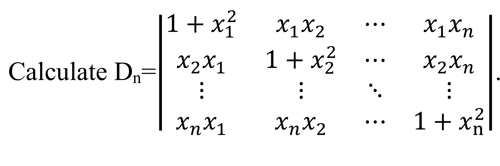

# Linear Algebra Tutorial4 
2023.10.31

---

# homework

---

# determinant 

1. 
$D=\begin{bmatrix}
a_1 & c_2 & c_3 & \cdots & c_n \\
b_2 & a_2 \\
b_3 & & a_3 \\
\vdots & & & \ddots \\
b_n & & & & a_n
\end{bmatrix}$

> $det(D)=\prod\limits_{i=1}^na_i - \sum\limits_{i=2}^n\dfrac{Ab_nc_n}{a_n}$
where $A=\prod\limits_{i=2}^na_i$

---

# determinant
2. 
$D = \begin{bmatrix}
a & b & 0 & \cdots & 0 & 0 \\
0 & a & b & \cdots & 0 & 0 \\
  \vdots & & & & & \vdots \\
0 & 0 & 0 & \cdots & a & b \\
b & 0 & 0 & \cdots & 0 & a
\end{bmatrix}$

> $|D|=a^n+(-1)^{1+n}b^n$

---

# determinant
3. 
$D_n = \begin{bmatrix}
b & -1 & 0 & \cdots & 0 & 0 \\
0 & b & -1 & \cdots & 0 & 0 \\
  \vdots & & & & & \vdots \\
0 & 0 & 0 & \cdots & b & -1 \\
a_n & a_{n-1} & a_{n-2} & \cdots & a_2 & b + a_1
\end{bmatrix}$

> $|D_n|=b\cdot |D_{n-1}| + a_n(-1)^{n+1}(-1)^{n-1}$
$|D_n|=b\cdot |D_{n-1}| + a_n$

---

# determinant
4. 

---

# determinant
5.
$A=\begin{bmatrix}
1 & 1 & 5 & 4 \\
2 & 3 & 2 & 4 \\
1 & 6 & 0 & 3 \\
4 & 2 & 5 & 1
\end{bmatrix}$

find $C_{21}+C_{22}+5C_{23}+4C_{24}$

where $C_{ij}$ is the cofactor of $a_{ij}$

---

# determinant
5. 
$A=\begin{bmatrix}
1 & 1 & 5 & 4 \\
2 & 3 & 2 & 4 \\
1 & 6 & 0 & 3 \\
4 & 2 & 5 & 1
\end{bmatrix}$

construct:
$A'=\begin{bmatrix}
1 & 1 & 5 & 4 \\
1 & 1 & 5 & 4 \\
1 & 6 & 0 & 3 \\
4 & 2 & 5 & 1
\end{bmatrix}$
so $C_{21}+C_{22}+5C_{23}+4C_{24}=|A'|$
and since $A'$ has two same rows, $|A'|=0$
so $C_{21}+C_{22}+5C_{23}+4C_{24}=0$

---