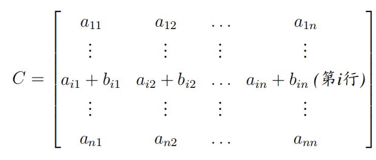
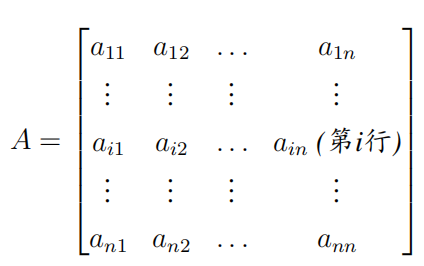
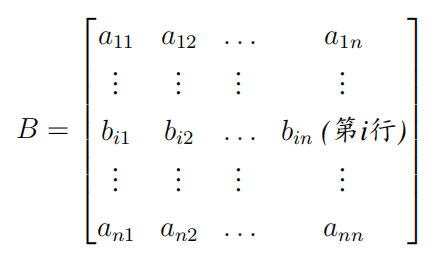
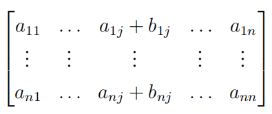
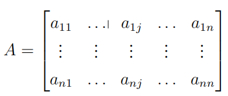
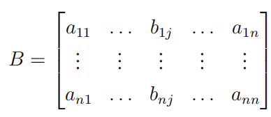

# Linear Algebra Tutorial4 
2023.10.31

---

# homework

- $A,B$ are upper triangular matrix, then $AB, A^k...$ are also upper triangular matrix

---

# determinant properties

> compare with the elementary row(column) operations
1. $B$ is obtained from $A$ by interchanging two rows(columns)
$|B|=-|A|$
2. $B$ is obtained from $A$ by multiplying one row(column) by a nonzero scalar $k$
$|B|=k|A|$
3. $B$ is obtained from $A$ by adding a multiple of one row(column) to another row(column)
$|B|=|A|$
> we can mix row and column operations when calculating the determinant
but we can only use row or column operations when calculating the inverse matrix!!!!

---

# determinant properties

> If a matrix $A$ have two same rows(columns), then $|A|=0$

suppose $B$ is $A$ swapping the two same rows(columns), from property 1, $|B|=-|A|$

but $B=A$, so $|B|=|A|$

so $|A|=-|A|$, $|A|=0$

---

# determinant property

 

> $|C| = |A| + |B|$

---

# determinant property

- similary

$C=$
 

> $|C| = |A| + |B|$
essentially: determinant expansion by column

**generally, $|C|\neq |A|+|B|$!!!**

---

# determinant property

- $|AB|=|A||B|$
  $\Rightarrow R=ABCD..., |R|=|A||B||C|...$
- $|A^T|=|A|$
- $|A^{-1}|=\dfrac{1}{|A|}$
- $|A^k|=|A|^k$
- $|\lambda A|=\lambda^n|A|$

---

# determinant
5.
$A=\begin{bmatrix}
1 & 1 & 5 & 4 \\
2 & 3 & 2 & 4 \\
1 & 6 & 0 & 3 \\
4 & 2 & 5 & 1
\end{bmatrix}$

find $C_{21}+C_{22}+5C_{23}+4C_{24}$

where $C_{ij}$ is the cofactor of $a_{ij}$

---

# determinant
5. 
$A=\begin{bmatrix}
1 & 1 & 5 & 4 \\
2 & 3 & 2 & 4 \\
1 & 6 & 0 & 3 \\
4 & 2 & 5 & 1
\end{bmatrix}$

construct:
$A'=\begin{bmatrix}
1 & 1 & 5 & 4 \\
1 & 1 & 5 & 4 \\
1 & 6 & 0 & 3 \\
4 & 2 & 5 & 1
\end{bmatrix}$
so $C_{21}+C_{22}+5C_{23}+4C_{24}=|A'|$
and since $A'$ has two same rows, $|A'|=0$
so $C_{21}+C_{22}+5C_{23}+4C_{24}=0$

---

# determinant property

$\forall A\in \mathbb{R}^{n\times n}$
- if $i\neq k$, then 
  $a_{i1}C_{k1}+a_{i2}C_{k2}+\cdots+a_{in}C_{kn}=0$

- if $i=k$, then 
  $a_{i1}C_{k1}+a_{i2}C_{k2}+\cdots+a_{in}C_{kn}=|A|$
  > so called **Laplace expansion**

---

# adjoint matrix
- $C$: matrix of cofactors from $A$

定义:....

- $A^*=adj(A)=C^T$
- If $A$ is **invertible**
  $A^{-1}=\dfrac{1}{|A|}A^*$
  $\Rightarrow AA^*=A^*A=|A|I$

---

# adjoint matrix

$|A^*| = |A|^{n-1}$

- but if $A$ is not invertible??

 $|A^*|=0$

---

# determinant 

1. 
$D=\begin{bmatrix}
a_1 & c_2 & c_3 & \cdots & c_n \\
b_2 & a_2 \\
b_3 & & a_3 \\
\vdots & & & \ddots \\
b_n & & & & a_n
\end{bmatrix}$

> $det(D)=\prod\limits_{i=1}^na_i - \sum\limits_{i=2}^n\dfrac{Ab_nc_n}{a_n}$
where $A=\prod\limits_{i=2}^na_i$

---

# determinant
2. 
$D = \begin{bmatrix}
a & b & 0 & \cdots & 0 & 0 \\
0 & a & b & \cdots & 0 & 0 \\
  \vdots & & & & & \vdots \\
0 & 0 & 0 & \cdots & a & b \\
b & 0 & 0 & \cdots & 0 & a
\end{bmatrix}$

> $|D|=a^n+(-1)^{1+n}b^n$

---

# determinant
3. 
$D_n = \begin{bmatrix}
b & -1 & 0 & \cdots & 0 & 0 \\
0 & b & -1 & \cdots & 0 & 0 \\
  \vdots & & & & & \vdots \\
0 & 0 & 0 & \cdots & b & -1 \\
a_n & a_{n-1} & a_{n-2} & \cdots & a_2 & b + a_1
\end{bmatrix}$

> $|D_n|=b\cdot |D_{n-1}| + a_n(-1)^{n+1}(-1)^{n-1}$
$|D_n|=b\cdot |D_{n-1}| + a_n$

---

# determinant
4. 

---

行列式计算中的一些常见技巧(不完全)：假设我们要求n阶矩阵Dn的行列式，
那么可以试图
• 通过一系列行变换或者列变换，构造出含有尽可能多0的一行或者一列，然
后沿着这一行或列进行代数余子式展开。这样通常会得到与Dn结构相同但
阶数减少的方阵Dk，k ≤ n − 1。由此我们可以找到Dn的行列式与Dk，k ≤
n − 1的行列式之间的关系，从而确定Dn行列式的通项公式。比如在例子1中
我们得到det(Dn) = Q n
j=1(xj − x0) det(Dn−1)，在例子3中我们得到det(Dn) −
det(Dn−1) = det(Dn−1) − det(Dn−2)。
• 首先计算几个低阶矩阵的行列式，比如D1，D2，D3，猜出Dn的通项公式，
然后使用数学归纳法。实际上，要使用数学归纳法，我们依然需要找到Dn的
行列式与Dk，k ≤ n−1的行列式之间的关系，比如第三次作业的Problem E。
• 更多具体技巧需要大家通过做题自己总结，或者参考一些课外教材，比如同
济大学出版社的线性代数习题集等。