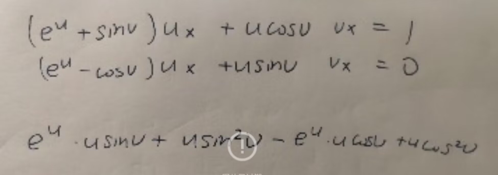

# Linear Algebra Tutorial4 
2023.10.31

---

# homework

- $A,B$ are upper triangular matrix, then $AB,  A^k...$ are also upper triangular matrix
  It is theorem on book, we do not need to prove it but need to mention it

- the symbol [] and || 
  [] for matrix, || for determinant

- **iff** $\Leftrightarrow$ if and only if  $\Leftrightarrow$ 当且仅当

---

# determinant properties

> compare with the elementary row(column) operations
1. $B$ is obtained from $A$ by interchanging two rows(columns)
$|B|=-|A|$
2. $B$ is obtained from $A$ by multiplying one row(column) by a nonzero scalar $k$
$|B|=k|A|$
3. $B$ is obtained from $A$ by adding a multiple of one row(column) to another row(column)
$|B|=|A|$
> we can mix row and column operations when calculating the determinant
but we can only use row or column operations when calculating the inverse matrix!!!!

---

# determinant properties

> If a matrix $A$ have two same rows(columns), then $|A|=0$

suppose $B$ is $A$ swapping the two same rows(columns), from property 1, $|B|=-|A|$

but $B=A$, so $|B|=|A|$

so $|A|=-|A|$, $|A|=0$

---

# determinant property

 

> $|C| = |A| + |B|$

---

# determinant property

- similary

$C=$
 

> $|C| = |A| + |B|$
essentially: determinant expansion by column

**generally, $|C|\neq |A|+|B|$!!!**

---

# determinant property

- $|AB|=|A||B|$
  $\Rightarrow R=ABCD..., |R|=|A||B||C|...$
- $|A^T|=|A|$
- $|A^{-1}|=\dfrac{1}{|A|}$
- $|A^k|=|A|^k$
- $|\lambda A|=\lambda^n|A|$

---

# Cramer's rule

$A\mathbf{x}=\mathbf{b}$, $|A|\neq 0$ ($A_{n\times n}$)

$A=\begin{bmatrix}
a_{11} & a_{12} & \cdots & a_{1n} \\
a_{21} & a_{22} & \cdots & a_{2n} \\
\vdots & & & \vdots \\
a_{n1} & a_{n2} & \cdots & a_{nn}
\end{bmatrix}$, $A_i=\begin{bmatrix}
a_{11} & a_{12} & \cdots & a_{1,i-1} & b_1 & a_{1,i+1} & \cdots & a_{1n} \\
a_{21} & a_{22} & \cdots & a_{2,i-1} & b_2 & a_{2,i+1} & \cdots & a_{2n} \\
\vdots & & & & \vdots & & & \vdots \\
a_{n1} & a_{n2} & \cdots & a_{n,i-1} & b_n & a_{n,i+1} & \cdots & a_{nn}
\end{bmatrix}$

then $x_i=\dfrac{|A_i|}{|A|}$

where $A_i$ is the matrix obtained from $A$ by replacing the $i$th column of $A$ by $\mathbf{b}$

---

# Cramer's rule
- e.g. when the coefficient is complicated

---

# Cramer's rule

$(e^u+\sin v)\dfrac{\partial u}{\partial x}+(u\cos v)\dfrac{\partial v}{\partial x}=1$
$(e^u-\cos v)\dfrac{\partial u}{\partial x}    +(u\sin v)\dfrac{\partial v}{\partial x}=0$

with Cramer's rule, we can get 
$\dfrac{\partial u}{\partial x}=\dfrac{\big|\begin{matrix}
1 & u\cos v \\
0 & u\sin v
\end{matrix}\big|}
{\big|\begin{matrix}
e^u+\sin v & u\cos v \\
e^u-\cos v & u\sin v
\end{matrix}\big|}$= $\dfrac{\sin v}{e^u(\sin v-\cos v) +1}$,
$\dfrac{\partial v}{\partial x}= \dfrac{\big|\begin{matrix}
e^u+\sin v & 1 \\
e^u-\cos v & 0
\end{matrix}\big|}
{\big|\begin{matrix}
e^u+\sin v & u\cos v \\
e^u-\cos v & u\sin v
\end{matrix}\big|}$= $\dfrac{-(e^u-\cos v)}{(e^u(\sin v-\cos v) +1)u}$

---

# determinant
5.
$A=\begin{bmatrix}
1 & 1 & 5 & 4 \\
2 & 3 & 2 & 4 \\
1 & 6 & 0 & 3 \\
4 & 2 & 5 & 1
\end{bmatrix}$

find $C_{21}+C_{22}+5C_{23}+4C_{24}$

where $C_{ij}$ is the cofactor of $a_{ij}$

---

# determinant
5. 
$A=\begin{bmatrix}
1 & 1 & 5 & 4 \\
2 & 3 & 2 & 4 \\
1 & 6 & 0 & 3 \\
4 & 2 & 5 & 1
\end{bmatrix}$

construct:
$A'=\begin{bmatrix}
1 & 1 & 5 & 4 \\
1 & 1 & 5 & 4 \\
1 & 6 & 0 & 3 \\
4 & 2 & 5 & 1
\end{bmatrix}$
so $C_{21}+C_{22}+5C_{23}+4C_{24}=|A'|$
and since $A'$ has two same rows, $|A'|=0$
so $C_{21}+C_{22}+5C_{23}+4C_{24}=0$

---

# determinant property

$\forall A\in \mathbb{R}^{n\times n}$
- if $i\neq k$, then 
  $a_{i1}C_{k1}+a_{i2}C_{k2}+\cdots+a_{in}C_{kn}=0$

- if $i=k$, then 
  $a_{i1}C_{k1}+a_{i2}C_{k2}+\cdots+a_{in}C_{kn}=|A|$
  > so called **Laplace expansion**

---

# adjoint matrix
- $C_{i,j}$: matrix of cofactors of $a_{i,j}$
**代数余子式**
- $C$ : matrix of cofactors from $A$
  $A$的代数余子式矩阵

i.e. $C=\begin{bmatrix}
C_{11} & C_{12} & \cdots & C_{1n} \\
C_{21} & C_{22} & \cdots & C_{2n} \\
\vdots & & & \vdots \\
C_{n1} & C_{n2} & \cdots & C_{nn}
\end{bmatrix}$

- $A^*=adj(A)=C^T$
- **no matter $A$ is invertible or not**,$AA^*=A^*A=|A|I$
- If $A$ is **invertible**, $A^{-1}=\dfrac{1}{|A|}A^*$

---

# adjoint matrix

- $|A^*| = |A|^{n-1}$
$AA^*=|A|I$
$|AA^*|=|A|^n|I|=|A|^n$
$|A^*||A|=|A|^n$
$|A^*|=|A|^{n-1}$

> any constrains? 

---

# adjoint matrix

- but if $A$ is not invertible??
  i.e. $|A|=0$
  is $|A^*|=0$?

- Proof by Contradiction
  suppose $|A^*|\neq 0$, then
  $(AA^{*})(A^{*})^{-1}=|A|I(A^*)^{-1}=\mathbf{0}$
  also, $(AA^{*})(A^{*})^{-1}=A(A^*(A^*)^{-1})=A$

  so $A=0 \Rightarrow A^*=0$, which is a contradiction with $|A^*|\neq 0$

  so $|A^*|=0$

> so $|A^*|=|A|^{n-1}$ is always true
---

# determinant 

1. 
$D=\begin{bmatrix}
a_1 & c_2 & c_3 & \cdots & c_n \\
b_2 & a_2 \\
b_3 & & a_3 \\
\vdots & & & \ddots \\
b_n & & & & a_n
\end{bmatrix}$

> $det(D)=\prod\limits_{i=1}^na_i - \sum\limits_{i=2}^n\dfrac{Ab_nc_n}{a_n}$
where $A=\prod\limits_{i=2}^na_i$

---

# determinant
2. 
$D = \begin{bmatrix}
a & b & 0 & \cdots & 0 & 0 \\
0 & a & b & \cdots & 0 & 0 \\
  \vdots & & & & & \vdots \\
0 & 0 & 0 & \cdots & a & b \\
b & 0 & 0 & \cdots & 0 & a
\end{bmatrix}$

> $|D|=a^n+(-1)^{1+n}b^n$

---

# determinant
3. 
$D_n = \begin{bmatrix}
b & -1 & 0 & \cdots & 0 & 0 \\
0 & b & -1 & \cdots & 0 & 0 \\
  \vdots & & & & & \vdots \\
0 & 0 & 0 & \cdots & b & -1 \\
a_n & a_{n-1} & a_{n-2} & \cdots & a_2 & b + a_1
\end{bmatrix}$

---

# determinant
4. 

---
# some mostly used tricks
- row(column) operations, construct a row(column) with as many zeros as possible, then use the Laplace expansion

- try to calculate the determinant with lower dimension, the use induction

- **practice more!!**

---
# linear space
inner product $<\cdot, \cdot>$
- $\mathbb{R}^n$ vector: dot product $\mathbf{x}\cdot\mathbf{y}=\mathbf{x}^T\mathbf{y}=\mathbf{y}^T\mathbf{x}$
- $M_{m\times n}(\mathbb{R})$ matrix: $<A,B>=tr(B^TA)$
- $P_n(\mathbb{R})$ polynomial: $<p,q>=\int_0^1p(x)q(x)dx$
- $C[a,b]$ continuous function: $<f,g>=\int_a^bf(x)g(x)dx$
$\vdots$

---

# linear space
angle $\theta$ between two vectors $\mathbf{x},\mathbf{y}$
$cos\theta = \dfrac{<\mathbf{x},\mathbf{y}>}{\sqrt{<\mathbf{x},\mathbf{x}>}\cdot\sqrt{<\mathbf{y},\mathbf{y}>}} = \dfrac{\mathbf{x}^T\mathbf{y}}{\left\|\mathbf{x}\right\|\left\|\mathbf{\mathbf{y}}\right\|}$

so $\mathbf{x}\cdot\mathbf{y}=\left\|\mathbf{x}\right\|\left\|\mathbf{\mathbf{y}}\right\|cos\theta$

$\mathbf{x}\cdot \mathbf{y}=0\Leftrightarrow \mathbf{x}\perp \mathbf{y}$

---

# cross product
$\mathbf{x}\times\mathbf{y}=\begin{bmatrix}
x_2y_3-x_3y_2 \\
x_3y_1-x_1y_3 \\
x_1y_2-x_2y_1
\end{bmatrix}$
- $\mathbf{x}\times\mathbf{y}$ is orthogonal to both $\mathbf{x}$ and $\mathbf{y}$
- $\left\|\mathbf{x}\times\mathbf{y}\right\|=\left\|\mathbf{x}\right\|\left\|\mathbf{y}\right\|sin\theta$
- $\mathbf{x}\times\mathbf{y}=-\mathbf{y}\times\mathbf{x}$
- $\mathbf{x}\times(\mathbf{y}+\mathbf{z})=\mathbf{x}\times\mathbf{y}+\mathbf{x}\times\mathbf{z}$
- $(k\mathbf{x})\times\mathbf{y}=k(\mathbf{x}\times\mathbf{y})$

---

# cross product
- the cross product of two vectors can be represented by the determinant
$\mathbf{x}\times\mathbf{y}=\begin{vmatrix}
\mathbf{i} & \mathbf{j} & \mathbf{k} \\
x_1 & x_2 & x_3 \\
y_1 & y_2 & y_3
\end{vmatrix}$
- $\mathbf{x}\times\mathbf{y}=\mathbf{0}\Leftrightarrow \mathbf{x}\parallel\mathbf{y}$

- we can also transfer $\mathbf{x}$ into a matrix $[\mathbf{x}]\mathbf{y}$
where $[\mathbf{x}]=\begin{bmatrix}
0 & -x_3 & x_2 \\
x_3 & 0 & -x_1 \\
-x_2 & x_1 & 0
\end{bmatrix}$

> notice that $[\mathbf{x}]$ is skew-symmetric, so its rank is odd
actually, rank($[\mathbf{x}]$)=2