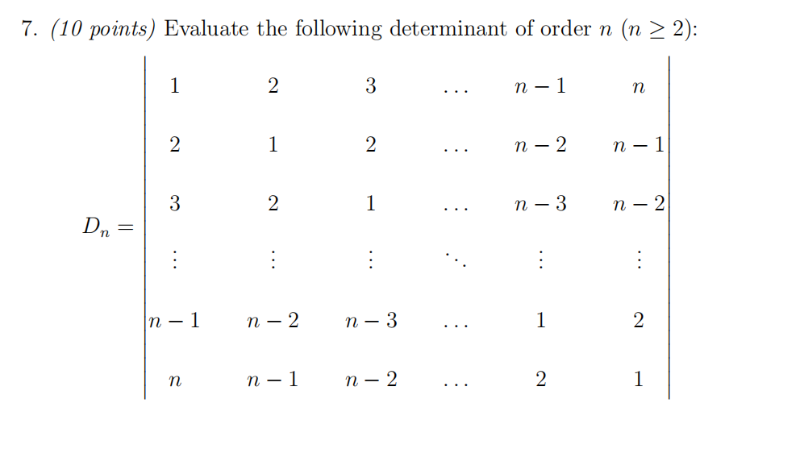
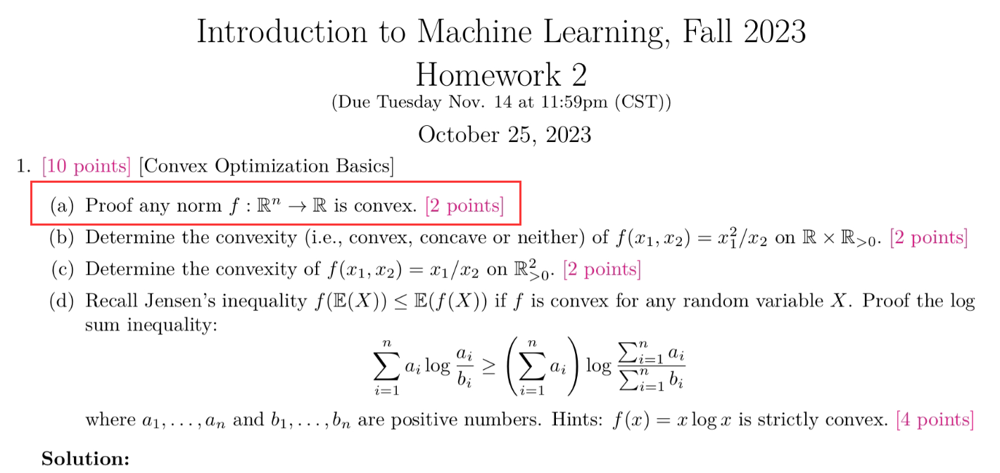
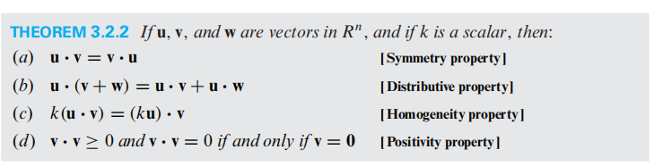
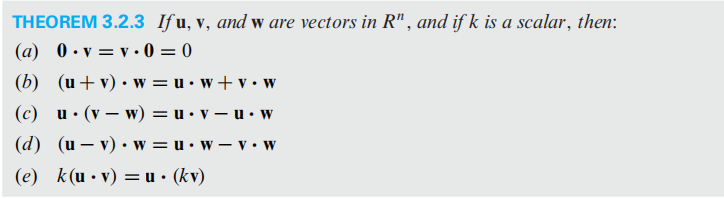
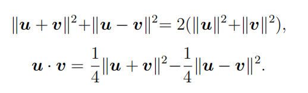
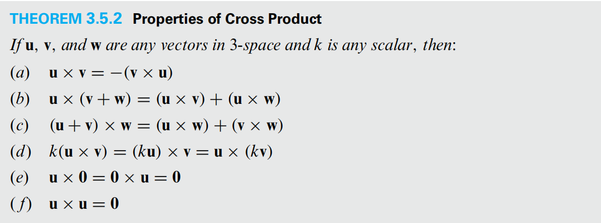
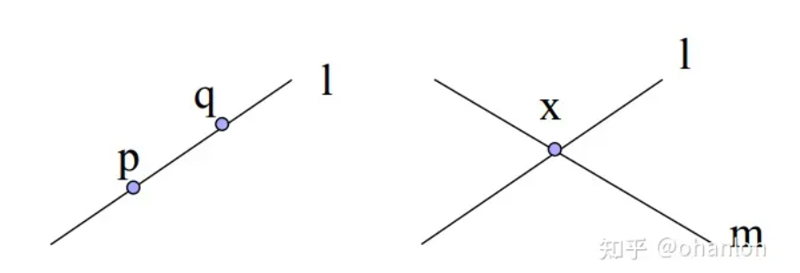

# Linear Algebra Tutorial5
2023.11.7

---

# homework
- bonus
$A,B\in M_{3\times 3}$
$A^2-AB-2B^2=A-2BA-B$
$B=\begin{bmatrix}
-1 & 2 & 1 \\
0 & 1 & -1 \\
1 & 3 & 2
\end{bmatrix}$
$det(A-B)\neq 0$

---

---

# Cramer's rule

$A\mathbf{x}=\mathbf{b}$, $|A|\neq 0$ ($A_{n\times n}$)

$A=\begin{bmatrix}
a_{11} & a_{12} & \cdots & a_{1n} \\
a_{21} & a_{22} & \cdots & a_{2n} \\
\vdots & & & \vdots \\
a_{n1} & a_{n2} & \cdots & a_{nn}
\end{bmatrix}$, $A_i=\begin{bmatrix}
a_{11} & a_{12} & \cdots & a_{1,i-1} & b_1 & a_{1,i+1} & \cdots & a_{1n} \\
a_{21} & a_{22} & \cdots & a_{2,i-1} & b_2 & a_{2,i+1} & \cdots & a_{2n} \\
\vdots & & & & \vdots & & & \vdots \\
a_{n1} & a_{n2} & \cdots & a_{n,i-1} & b_n & a_{n,i+1} & \cdots & a_{nn}
\end{bmatrix}$

then $x_i=\dfrac{|A_i|}{|A|}$

where $A_i$ is the matrix obtained from $A$ by replacing the $i$th column of $A$ by $\mathbf{b}$

---

# Cramer's rule

- e.g. when the coefficient is complicated
- **directly solve one of the variables**

---

# determinant property

 

> $|C| = |A| + |B|$

---

# determinant property

calculate $\left | \begin{matrix}
ax+by & ay+bz & az+bx \\
ay+bz & az+bx & ax+by \\
az+bx & ax+by & ay+bz  
\end{matrix} \right |$

---

# determinant practice

---

# math review
- vector
- Cauchy inequality
- dot product
- cross product
$\vdots$

---

# Euclidean space

- $\mathbb{R}^n$ n-dimensional Euclidean space(can be seen as ordered $n$-tuples)
  $\mathbf{v}\in\mathbb{R}^n$, $\mathbf{v}=(v_1,\cdots,v_n)$
- **linear combination**
  $\mathbf{w} = k_1\mathbf{v}_1 + k_2\mathbf{v}_2 + \cdots + k_r\mathbf{v}_r$
  $\mathbf{w}$ is the linear combination of $\mathbf{v}_1,\cdots,\mathbf{v}_r$
  $k_1,\cdots,k_r$ are the coefficients of $\mathbf{v}_1,\cdots,\mathbf{v}_r$
- **span**
    the set of all linear combinations of $\mathbf{v}_1,\cdots,\mathbf{v}_r$ is called the span of $\mathbf{v}_1,\cdots,\mathbf{v}_r$
    $span\{\mathbf{v}_1,\cdots,\mathbf{v}_r\}=\{\mathbf{w}|\mathbf{w}=k_1\mathbf{v}_1 + k_2\mathbf{v}_2 + \cdots + k_r\mathbf{v}_r, k_1,\cdots,k_r\in\mathbb{R}\}$
---

# linear independence

- standard unit vector 标准单位向量
    there are $n$ standard unit vectors in $\mathbb{R}^n$
    $\mathbf{e}_i=(0,\cdots,0,1,0,\cdots,0)$
    $\mathbf{e}_i$ has 1 in the $i$-th position and 0 elsewhere
    eg. $\mathbf{w}=(1, 2)$, $\mathbf{w}=1\mathbf{e}_1+2\mathbf{e}_2$

- is the representation unique?
    $\mathbf{w}=(1,2)$
    $\mathbf{v_1}=(1, 0),\mathbf{v_2} = (0, 1),\mathbf{v_3} = (1, 1)$
    $\mathbf{w}=1\mathbf{v_1}+2\mathbf{v_2}+0\mathbf{v_3}$
    $\mathbf{w}=-1\mathbf{v_1}+0\mathbf{v_2}+1\mathbf{v_3}$
    $\mathbf{w}=0\mathbf{v_1}+1\mathbf{v_2}+1\mathbf{v_3}$
> unique represetation $\Leftrightarrow$ linearly independent
---

# linear independence
- $\mathbf{v}_1,\cdots,\mathbf{v}_r$ are linearly independent if the only solution of $k_1\mathbf{v}_1 + k_2\mathbf{v}_2 + \cdots + k_r\mathbf{v}_r=\mathbf{0}$ is $k_1=k_2=\cdots=k_r=0$
- $\mathbf{v}_1,\cdots,\mathbf{v}_r$ are linearly dependent if and only if one of them is a linear combination of the others

---

# norm

- norm(Euclidean norm)
$\left\|\mathbf{v}\right\|=\sqrt{v_1^2+v_2^2+\cdots+v_n^2}$
    distance to the origin
    $\left\|\mathbf{v}\right\|\geq 0$
    $\left\|\mathbf{v}\right\|=0\Leftrightarrow \mathbf{v}=\mathbf{0}$
    $\left\|k\mathbf{v}\right\|=|k|\left\|\mathbf{v}\right\|$

- normalization
    $\mathbf{u}=\dfrac{\mathbf{v}}{\left\|\mathbf{v}\right\|}$
    get the **unit vector** $\mathbf{u}$: normailize $\mathbf{v}$

---

# other different norms*

$p$ norm of a vector $\mathbf{v}=(v_1,\cdots,v_n)$
$\left\|\mathbf{v}\right\|_p=\sqrt[p]{|v_1|^p+|v_2|^p+\cdots+|v_n|^p}$

- $0$ norm:
    $\left\|\mathbf{v}\right\|_0$ is the number of nonzero entries in $\mathbf{v}$
    **not good** due to it is **not convex**

- $1$ norm:
    $\left\|\mathbf{v}\right\|_1=|v_1|+|v_2|+\cdots+|v_n|$

- $2$ norm(Euclidean norm):
    $\left\|\mathbf{v}\right\|_2=\sqrt{v_1^2+v_2^2+\cdots+v_n^2}$

- $\infty$ norm:
    $\left\|\mathbf{v}\right\|_\infty=max\{|v_1|,|v_2|,\cdots,|v_n|\}$

---

# properties of norm*

$p$-norm : $\left\|\mathbf{v}\right\|_p=\sqrt[p]{|v_1|^p+|v_2|^p+\cdots+|v_n|^p}$,  **$p\geq 1$**
 
- $0$ norm is actually not a norm, but matric(度量)
- Cauchy inequality
    $\sum\limits_{i=1}^n|a_ib_i|\leq\sqrt{\sum\limits_{i=1}^na_i^2}\sqrt{\sum\limits_{i=1}^nb_i^2}$
- Hölder's inequality (赫尔德不等式)
    $p,q\geq 1$, $\dfrac{1}{p}+\dfrac{1}{q}=1$
    $\sum\limits_{i=1}^n|a_ib_i|\leq\left\|x\right\|_p\left\|y\right\|_q$
    $\sum\limits_{i=1}^n|a_ib_i|\leq\left\|x\right\|_1\left\|y\right\|_\infty$
    $\sum\limits_{i=1}^n|a_ib_i|\leq\left\|x\right\|_2\left\|y\right\|_2$ -> Cauchy inequality

---

# properties of norm*

- Minkowski's inequality(闵可夫斯基不等式)
$\left\|\mathbf{x}+\mathbf{y}\right\|_p\leq\left\|\mathbf{x}\right\|_p+\left\|\mathbf{y}\right\|_p$
when $p=2$: triangle inequality
- $\left\|\mathbf{x}\right\|\geq 0, \left\|\mathbf{x}\right\|=0\Leftrightarrow \mathbf{x}=\mathbf{0}$
- $\forall a, \left\|a\mathbf{x}\right\|=|a|\left\|\mathbf{x}\right\|$
- all norm $f:\mathbb{R}^n\to \mathbb{R}$ are convex.

- to learn more in IML/numerical optimazation/convex optimazation/...

---

# properties of norm*

---

# distance
the Euclidean distance between $\mathbf{u}$ and $\mathbf{v}$
$d(u,v)=d(u,v)=\left\|\mathbf{u}-\mathbf{v}\right\|=\sqrt{(u_1-v_1)^2+(u_2-v_2)^2+\cdots+(u_n-v_n)^2}$

---

# Cauchy-Schwarz inequality
- vector version
 $|\mathbf{u}\cdot\mathbf{v}|\leq\left\|\mathbf{u}\right\|\cdot\left\|\mathbf{v}\right\|$
- calculus version
 $\int_a^b f(x)g(x)dx\leq\sqrt{\int_a^b f^2(x)dx}\sqrt{\int_a^b g^2(x)dx}$
- probability version
 $|E(XY)|\leq\sqrt{E(X^2)}\sqrt{E(Y^2)}$

---

# triangle inequality

- $d(\mathbf{u},\mathbf{v})\leq d(\mathbf{u},\mathbf{w})+d(\mathbf{w},\mathbf{v})$

- $\left\|\mathbf{u}+\mathbf{v}\right\|\leq\left\|\mathbf{u}\right\|+\left\|\mathbf{v}\right\|$

---

# dot(inner) product
- $\mathbf{u}\cdot\mathbf{w}=u_1w_1+u_2w_2+\cdots+u_nw_n$

So the Euclidean norm can be represented by the dot product
- $\left\|\mathbf{v}\right\|=\sqrt{\mathbf{v}\cdot\mathbf{v}}$

regard $\mathbf{v},\mathbf{w}$ as a column vector
$\mathbf{v}\cdot\mathbf{w}=\mathbf{w}\cdot\mathbf{v}=\mathbf{v}^T\mathbf{w}=\mathbf{w}^T\mathbf{v}$

if $A_{n\times n}$, $\mathbf{v},\mathbf{w}\in\mathbb{R}^n$

- $\mathbf{Av}\cdot\mathbf{w}=(\mathbf{Av})^T\mathbf{w}=\mathbf{v}^T\mathbf{A}^T\mathbf{w}=\mathbf{v}\cdot\mathbf{A}^T\mathbf{w}$
- $\mathbf{v}\cdot\mathbf{Aw}=\mathbf{v}^T(\mathbf{A}\mathbf{w})=(\mathbf{v}^T\mathbf{A})\mathbf{w}=(\mathbf{A}\mathbf{v}^T)^T\mathbf{w}=\mathbf{A}^T\mathbf{v}\cdot\mathbf{w}$

---

# dot prodcut 

---

- Theorem

---

# angle
angle $\theta$ between two vectors $\mathbf{x},\mathbf{y}$ **$\leftarrow$ no zero vector**
- $cos\theta = \dfrac{<\mathbf{x},\mathbf{y}>}{\sqrt{<\mathbf{x},\mathbf{x}>}\cdot\sqrt{<\mathbf{y},\mathbf{y}>}} = \dfrac{\mathbf{x}^T\mathbf{y}}{\left\|\mathbf{x}\right\|\left\|\mathbf{\mathbf{y}}\right\|}$

so $\mathbf{x}\cdot\mathbf{y}=\left\|\mathbf{x}\right\|\left\|\mathbf{\mathbf{y}}\right\|cos\theta$

- $\mathbf{x}\cdot \mathbf{y}=0\Leftrightarrow \mathbf{x}\perp \mathbf{y}$

- $\theta = \arccos(\dfrac{\mathbf{x}\cdot\mathbf{y}}{\left\|\mathbf{x}\right\|\left\|\mathbf{\mathbf{y}}\right\|})$
Cauchy inequality:
$|\dfrac{\mathbf{x}\cdot\mathbf{y}}{\left\|\mathbf{x}\right\|\left\|\mathbf{\mathbf{y}}\right\|}|\leq 1$

---

# Orthogonal

- $\mathbf{u},\mathbf{v}$ are orthogonal **iff** $\mathbf{u}\cdot\mathbf{v}=0$

- orthogonal set
$\mathbf{v}_1,\cdots,\mathbf{v}_n$ are orthogonal
$\left\|\mathbf{v}_1+\cdots+\mathbf{v}_n\right\|= \left\|\mathbf{v}_1\right\|+\cdots+\left\|\mathbf{v}_n\right\|$
proof in homework

---

# Projection Theorem
- orthogonal projection of $\mathbf{u}$ on $\mathbf{v}$
$\mathbf{w}_1=proj_{\mathbf{v}}(\mathbf{u})=\dfrac{\mathbf{u}\cdot\mathbf{v}}{\left\|\mathbf{v}\right\|^2}\mathbf{v}$

- the vector component of \mathbf{u} orthogonal to \mathbf{v}
$\mathbf{w}_2=\mathbf{u}-\mathbf{w}_1=\mathbf{u}-proj_{\mathbf{v}}(\mathbf{u})=\mathbf{u}-\dfrac{\mathbf{u}\cdot\mathbf{v}}{\left\|v\right\|^2}\mathbf{v}$

---

# The geometry of linear systems

- For linear system, $A\mathbf{x}=\mathbf{b}$
$\mathbf{w}$ is a solution of $A\mathbf{x}=\mathbf{0}$(homogeneous system)
$\mathbf{s}$ is a specific solution of $A\mathbf{x}=\mathbf{b}$

Then every solution of $A\mathbf{x}=\mathbf{b}$ is of the form $\mathbf{v}=\mathbf{s}+\mathbf{w}$

**important in the whole learning process of Linear Algebra**

---

# The geometry of linear systems
- for the homogeneous system $A\mathbf{x}=\textbf{0}$

- consider the $A$ as a sequence of row vectors,
i.e. $A=\begin{bmatrix}
\mathbf{r}_1 \\
\mathbf{r}_2 \\
\vdots \\
\mathbf{r}_m
\end{bmatrix}$

- and $\mathbf{s}$ is a solution to the homogenous system

Then we have $\forall i, \mathbf{r}_i\cdot\mathbf{s}=0$
and $\sum\limits_{i=1}^m\mathbf{r}_i\cdot s_i =0$

> linear independent

---

# cross product
  

---

# cross product
$\mathbf{x}\times\mathbf{y}=\begin{bmatrix}
x_2y_3-x_3y_2 \\
x_3y_1-x_1y_3 \\
x_1y_2-x_2y_1
\end{bmatrix}$
- $\mathbf{x}\times\mathbf{y}$ is orthogonal to both $\mathbf{x}$ and $\mathbf{y}$
- $\left\|\mathbf{x}\times\mathbf{y}\right\|=\left\|\mathbf{x}\right\|\left\|\mathbf{y}\right\|sin\theta$

---

# cross product
- the cross product of two vectors can be represented by the determinant
$\mathbf{x}\times\mathbf{y}=\begin{vmatrix}
\mathbf{i} & \mathbf{j} & \mathbf{k} \\
x_1 & x_2 & x_3 \\
y_1 & y_2 & y_3
\end{vmatrix}$
- $\mathbf{x}\times\mathbf{y}=\mathbf{0}\Leftrightarrow \mathbf{x}\parallel\mathbf{y}$

- we can also transfer $\mathbf{x}$ into a matrix $[\mathbf{x}]\mathbf{y}$
where $[\mathbf{x}]=\begin{bmatrix}
0 & -x_3 & x_2 \\
x_3 & 0 & -x_1 \\
-x_2 & x_1 & 0
\end{bmatrix}$

> notice that $[\mathbf{x}]$ is skew-symmetric, so its rank is odd
actually, rank($[\mathbf{x}]$)=2

---

# cross product property

- just prove it in homework by the definition of cross product

---

# scalar triple product
- 标量三重积(混合积)
$\mathbf{x}\cdot(\mathbf{y}\times\mathbf{z})=\begin{vmatrix}
x_1 & x_2 & x_3 \\
y_1 & y_2 & y_3 \\
z_1 & z_2 & z_3
\end{vmatrix}$
- $\mathbf{x}\cdot(\mathbf{y}\times\mathbf{z})=\mathbf{y}\cdot(\mathbf{z}\times\mathbf{x})=\mathbf{z}\cdot(\mathbf{x}\times\mathbf{y})$
- $\mathbf{x}\cdot(\mathbf{y}\times\mathbf{z})=\mathbf{0}\Leftrightarrow \mathbf{x},\mathbf{y},\mathbf{z}$ are coplanar
- $\mathbf{x}\cdot(\mathbf{x}\times\mathbf{y})=\mathbf{y}\cdot(\mathbf{y}\times\mathbf{x})=0$

- Lagrange’s identity
$\left\|\mathbf{u}\times\mathbf{v}\right\|^2=\left\|\mathbf{u}\right\|^2\left\|\mathbf{v}\right\|^2-(\mathbf{u}\cdot\mathbf{v})^2$

---

# cross product geometric meaning

- parallelogram area
    平行四边形面积
    $S=\bar{AB}*\bar{AC}sin\theta=\left\|\mathbf{AB}\times\mathbf{AC}\right\|$
- volume of parallelepiped
    平行六面体体积
    $V=S_{base}h=\left\|\mathbf{AB}\times\mathbf{AC}\right\|\cdot\left\|\mathbf{AD}\right\|cos\alpha=\mathbf{AD}\cdot(\mathbf{AB}\times\mathbf{AC})$

---

# exercise (21-mid)

---

# exercise (20-mid)

---

# exercise

- $\mathbf{a}, \mathbf{b}, \mathbf{c}$ satisfy $\mathbf{a} + \mathbf{b} + \mathbf{c} = \textbf{0}$ and $\left\|\mathbf{a}\right\| = 3, \left\|\mathbf{b}\right\| = 5, \left\|\mathbf{c}\right\| = 7$.
find the angle between $\mathbf{a}$ and $\mathbf{b}$

- $\left\|\mathbf{a}\right\| = 2, \left\|\mathbf{b}\right\| = \sqrt{2}, \mathbf{a} \cdot \mathbf{b} = 2$.
find $\left\|\mathbf{a}\times\mathbf{b}\right\|$

---

# representation of lines and planes
- line
$\mathbf{r}=\mathbf{r}_0+t\mathbf{v}$
$\dfrac{x-x_0}{v_1}=\dfrac{y-y_0}{v_2}=\dfrac{z-z_0}{v_3}$
$\mathbf{v}=(v_1,v_2,v_3)$ is the direction vector of the line

- plane
$\mathbf{r}=\mathbf{r}_0+s\mathbf{v}+t\mathbf{w}$
$n_1(x-x_0)+n_2(y-y_0)+n_3(z-z_0)=0$
$\mathbf{n}=(n_1,n_2,n_3)$ is the normal vector of the plane
$\mathbf{n}= \mathbf{v}\times\mathbf{w}$

---

# distance from a point to a line/plane

- line(2-dimensional):
from $P_0(x_0,y_0)$ to $ax+by+c=0$
$d = \dfrac{|ax_0+by_0+c|}{\sqrt{a^2+b^2}}$
$\mathbf{n}=(a,b)$ is the normal vector of the line

- plane(3-dimensional):
from $P_0(x_0,y_0,z_0)$ to $ax+by+cz+d=0$
$d = \dfrac{|ax_0+by_0+cz_0+d|}{\sqrt{a^2+b^2+c^2}}$
$\mathbf{n}=(a,b,c)$ is the normal vector of the plane

---

# homogeneous coordinates*
- In 2D space, a point $p(x,y)$

- its homogeneous coordinates
$p(x,y,1)$

- a vector $\mathbf{v}=(x,y)$
its homogeneous coordinates is
$\mathbf{v}=(x,y,0)$

- a line $ax+by+c=0$
its homogeneous coordinates is
$\mathbf{v}=(a,b,c)$

- benefit1:
we can judge whether a point is on the line by $\mathbf{v}\cdot\mathbf{p}=0$

---

# homogeneous coordinates*
benefit2:
- we can easily get the line crossing two points:
$\mathbf{l}= \mathbf{p}\times\mathbf{q}$

- we can easily get the intersection of two lines:
$\mathbf{x}= \mathbf{l}\times\mathbf{m}$

---

# homogeneous coordinates*

benefit3:
we can easily transform a point in Euclidean space

$\begin{bmatrix}
p' \\
1
\end{bmatrix} = \begin{bmatrix}
R & \mathbf{t} \\
0 & 1
\end{bmatrix} \begin{bmatrix}
p \\
1
\end{bmatrix}$

where $\begin{bmatrix}
R & \mathbf{t} \\
0 & 1
\end{bmatrix}$ is the transformation matrix

> https://zhuanlan.zhihu.com/p/625678401