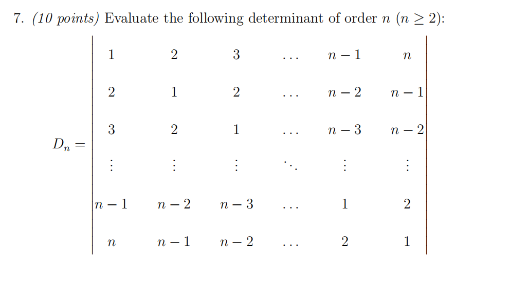
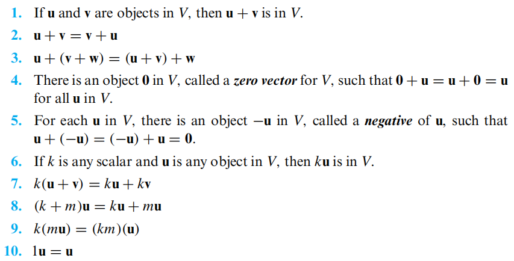
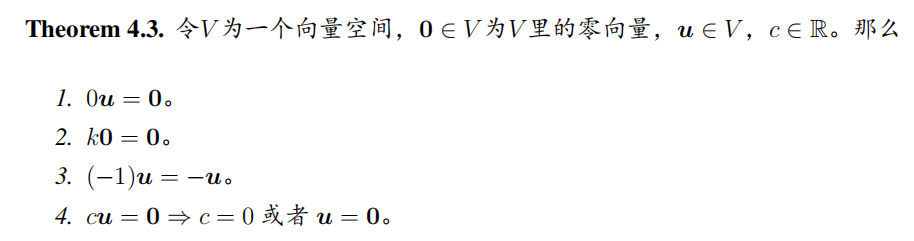

# Linear Algebra Tutorial6
2023.11.14

---

# homework
- about cross product 
    is applicable **only** to vectors in 3-space

- the norm of a vector
    $\left\|\mathbf{v}\right\|=\sqrt{v_1^2+v_2^2+\cdots+v_n^2}$

- the projection of a vector
    $proj_{\mathbf{u}}\mathbf{v}=\dfrac{\mathbf{u}\cdot\mathbf{v}}{\left\|\mathbf{u}\right\|^2}\mathbf{u}$

---

# determinant practice

---

# exercise

- $\mathbf{a}, \mathbf{b}, \mathbf{c}$ satisfy $\mathbf{a} + \mathbf{b} + \mathbf{c} = \textbf{0}$ and $\left\|\mathbf{a}\right\| = 3, \left\|\mathbf{b}\right\| = 5, \left\|\mathbf{c}\right\| = 7$.
find the angle between $\mathbf{a}$ and $\mathbf{b}$

- $\left\|\mathbf{a}\right\| = 2, \left\|\mathbf{b}\right\| = \sqrt{2}, \mathbf{a} \cdot \mathbf{b} = 2$.
find $\left\|\mathbf{a}\times\mathbf{b}\right\|$

---

# representation of lines and planes
- line
$\mathbf{r}=\mathbf{r}_0+t\mathbf{v}$
$\dfrac{x-x_0}{v_1}=\dfrac{y-y_0}{v_2}=\dfrac{z-z_0}{v_3}$
$\mathbf{v}=(v_1,v_2,v_3)$ is the direction vector of the line

- plane
$\mathbf{r}=\mathbf{r}_0+s\mathbf{v}+t\mathbf{w}$
$n_1(x-x_0)+n_2(y-y_0)+n_3(z-z_0)=0$
$\mathbf{n}=(n_1,n_2,n_3)$ is the normal vector of the plane
$\mathbf{n}= \mathbf{v}\times\mathbf{w}$

---

# distance from a point to a line/plane

- line(2-dimensional):
from $P_0(x_0,y_0)$ to $ax+by+c=0$
$d = \dfrac{|ax_0+by_0+c|}{\sqrt{a^2+b^2}}$
$\mathbf{n}=(a,b)$ is the normal vector of the line

- plane(3-dimensional):
from $P_0(x_0,y_0,z_0)$ to $ax+by+cz+d=0$
$d = \dfrac{|ax_0+by_0+cz_0+d|}{\sqrt{a^2+b^2+c^2}}$
$\mathbf{n}=(a,b,c)$ is the normal vector of the plane

---

# homogeneous coordinates*
- In 2D space, a point $p(x,y)$

- its homogeneous coordinates
$p(x,y,1)$

- a vector $\mathbf{v}=(x,y)$
its homogeneous coordinates is
$\mathbf{v}=(x,y,0)$

- a line $ax+by+c=0$
its homogeneous coordinates is
$\mathbf{v}=(a,b,c)$

- benefit1:
we can judge whether a point is on the line by $\mathbf{v}\cdot\mathbf{p}=0$

---

# homogeneous coordinates*
benefit2:
- we can easily get the line crossing two points:
$\mathbf{l}= \mathbf{p}\times\mathbf{q}$

- we can easily get the intersection of two lines:
$\mathbf{x}= \mathbf{l}\times\mathbf{m}$

--- 

# homogeneous coordinates*

benefit3:
we can easily transform a point in Euclidean space

$\begin{bmatrix}
p' \\
1
\end{bmatrix} = \begin{bmatrix}
R & \mathbf{t} \\
0 & 1
\end{bmatrix} \begin{bmatrix}
p \\
1
\end{bmatrix}$

where $\begin{bmatrix}
R & \mathbf{t} \\
0 & 1
\end{bmatrix}$ is the transformation matrix

> https://zhuanlan.zhihu.com/p/625678401

---

# Eucledian space $\Rightarrow$ Vector space
$\mathbb{R}^n\Rightarrow V$
the Euclidean space $\mathbb{R}^n$ is a special kind of vector space $V$
> vector space is also called linear space

---

# property of vector space

- If and only if the $10$ conditions are satisfied, then $V$ is a vector space.
- we call every element in the vector space "vector"
> compare with the properties of Euclidean space

---

- $+$ is an abstract operation, it may not be the addition in Euclidean space
    eg. we can define that $a+b=ab$
- $-u$ is the inverse(negative) of $u$, it may have $-u\neq -1u$
**but in vector space, $-u=-1u$**
- the most important thing is the defination of "+", "-", "$0$"
> the above defination may not be a vector space

---

# example of vector space
- $\mathbb{R}^n$
- $V=M_{m\times n}$
    "+" is the addition of matrices, $\mathbf{0}$ is the zero matrix
- all function $f:\mathbb{R}\to\mathbb{R}$ is the vector in $V=F(-\infty,+\infty)$
- the set of all polynomials of degree $\leq n$
    "+" the addtion for every coefficient

---

# theorem of vector space

---

# subspace

$V$ is a vector space, $W$ is a subset of $V$  **iff**

- $W$ is closed under addition
    $\forall \mathbf{u},\mathbf{v}\in W, \mathbf{u}+\mathbf{v}\in W$
- $W$ is closed under scalar multiplication
    $\forall \mathbf{u}\in W, \forall c\in \mathbb{R}, c\mathbf{u}\in W$

$W$ is the subspace of $V$ with the defination of "+" and "$\cdot$"
**$W$ is also a vector space**

---

# examples of subspace

- $\mathbf{u}=(1,1,1)\in\mathbb{R}^3, \mathbf{v}=(1,1,0)\in\mathbb{R}^3, \textbf{0}=(0,0,0)\in\mathbb{R}^3$
$W=\{k\mathbf{u}+c\mathbf{v},k\in\mathbb{R},c\in\mathbb{R}\}$
$W$ is a subspace of $\mathbb{R}^3$

- $W=\{A=M_{n\times n:A^T=A}\}$
$W$ is a subspace of $M_{n\times n}$

- $P_n \subset P_{\infty} \subset C^{\infty}(-\infty, \infty) \subset C^m(-\infty, \infty) \subset C^1(-\infty, \infty)$
$\subset C(-\infty, \infty) \subset F(-\infty, \infty)$

$P_n$ is the set of all polynomials of degree $\leq n$
All these are subspaces of $F(-\infty, \infty)$

---

# examples of subspace

- the set of all invertible matrices is **not** a subspace of $M_{n\times n}$

---

# subspace

- the intersection of two subspaces is also a subspace
$W_1,\cdots,W_r$ are the subspaces of $V$, then $W_1\cap\cdots\cap W_r$ is also a subspace of $V$
- the union of two subspaces is not necessarily a subspace(usually not)

---

# zero space

for all vector space $V$, $\{\mathbf{0}\}$ is a subspace of $V$
- $\mathbf{0} + \mathbf{0} = \mathbf{0}$
- $c\mathbf{0} = \mathbf{0}$ 

---

# linear combination
$V$ is a vector space, $S=\{\mathbf{v}_1,\cdots,\mathbf{v}_r\in V\}$
$W=\{c_1\mathbf{v}_1+\cdots+c_r\mathbf{v}_r,c_1,\cdots,c_r\in\mathbb{R}\}$
- $W$ is all the linear combination of $\mathbf{v}_1,\cdots,\mathbf{v}_r$
- $W$ is a subspace of $V$
- **$W$ is the smallest subspace of $V$ containing $\mathbf{v}_1,\cdots,\mathbf{v}_r$**
- We call $W=span(\mathbf{v}_1,\cdots,\mathbf{v}_r)$ or $W=span(S)$
the span of $\mathbf{v}_1,\cdots,\mathbf{v}_r$

---

# span
$S=\{\mathbf{v}_1,\cdots,\mathbf{v}_r\in V\}$ is a subset of $V$
$W=span(S)$ is the span of $S$
- $W$ is the smallest subspace of $V$ containing $S$
- $W$ is all the linear combination of $\mathbf{v}_1,\cdots,\mathbf{v}_r$

---

# span
Let $e_i=(0,\cdots,0,1,0,\cdots,0)\in\mathbb{R}^n$, where $1$ is in the $i$-th position
$S=\{e_1,\cdots,e_n\}$ is the standard basis of $\mathbb{R}^n$
- $span(S)=\mathbb{R}^n$
- $\forall \mathbf{v}\in\mathbb{R}^n, \mathbf{v}=v_1e_1+\cdots+v_ne_n$

> what set of vectors can span $\mathbb{R}^n$?
- can $\mathbf{v}_1=(1,1,2), \mathbf{v}_2=(1,0,1), \mathbf{v}_3=(2,1,3)$ span $\mathbb{R}^3$?
- can $\mathbf{v}_1=(1,0,0), \mathbf{v}_2=(0,1,0)$ span $\mathbb{R}^3$? 
- can $\mathbf{v}_1=(1,0,0), \mathbf{v}_2=(0,1,0), \mathbf{v}_3=(0,0,1), \mathbf{v}_4=(1,1,1)$ span $\mathbb{R}^3$? 
> when will it have a unique solution?

---

# linear independence
$V$ is a vector space, $S=\{\mathbf{v}_1,\cdots,\mathbf{v}_r\in V\}$, $r\geq 2$

If we say $S$ is linearly independent set, or say $\mathbf{v}_1,\cdots,\mathbf{v}_r$ are linearly independent vectors, we mean that
- $\forall i, \mathbf{v}_i$ can not be represented by the linear combination of the other vectors in $S$

---

# linear independence
The way we usually use to prove that $\mathbf{v}_1,\cdots,\mathbf{v}_r$ are linearly independent 

- We call $S$ a linearly independent set **iff**
$\exists c_1,\cdots,c_r\in\mathbb{R}$, 
$c_1\mathbf{v}_1+\cdots+c_r\mathbf{v}_r=\mathbf{0}$
only when $c_1=\cdots=c_r=0$

> proof by contradiction
WLOG, we usually set $\mathbf{v}_1$ can be represented by the linear combination of the other vectors.

---
# linear independence
- $S=\{\mathbf{e}_1,\cdots,\mathbf{e}_n\}$ in $\mathbb{R}^n$ is the standard basis of $\mathbb{R}^n$

- $p_0(x)=1, p_1(x)=x, p_2(x)=x^2, \cdots, p_n(x)=x^n$ are linearly independent in $P_n$

---
# linear independence
Let $c\in\mathbb{R}$, suppose that
$p_1(x)=1-2x, p_2(x)=3+x-cx^2, p_3(x)=-1+3x^2,$$p_4(x)=1+2021x+2021^2x^2+2021^3x^3$ 
Find $c$ s.t. $p_1,p_2,p_3,p_4$ are linearly independent

---
# linear independence's property
$V$ is a vector space, $S=\{\mathbf{v}_1,\cdots,\mathbf{v}_r\in V\}$ is a subset if $V$
$S$ is a linearly independent set **iff**
every vector in $W=span(S)$ has an unique representation

> proof by contradiction

---
# linear independence's property
- Let $S=\{\mathbf{v}_1,\cdots,\mathbf{v}_r\}$ be a subset of $\mathbb{R}^n$
**If $r>n$, then $S$ is linearly dependent**

proof:
Let $k_1\mathbf{v}_1+\cdots+k_r\mathbf{v}_r=\mathbf{0}$, where $k_1,\cdots,k_r\in\mathbb{R}$
Then the coefficient matrix is $A=\begin{bmatrix}
v_{11} & \cdots & v_{1r} \\
\vdots & \ddots & \vdots \\
v_{n1} & \cdots & v_{nr}
\end{bmatrix}$

since $r>n$, which means the numbers of variables is more than the numbers of equations, then there must be a non-trivial solution, which means $S$ is linearly dependent

---
# Coordinates and basis
$V$ is a finite-dimensional vector space, $S=\{\mathbf{v}_1,\cdots,\mathbf{v}_r\}$ is a subset of $V$
If
- $S$ is linearly independent
- $V=span(S)$

then we call $S$ a basis of $V$
the number of vectors in $S$ is the dimension of $V$, denoted as $dim(V)$

---
# Coordinates and basis
We have mentioned that
$S=\{\mathbf{e}_1,\cdots,\mathbf{e}_n\}$ 
$span(S)=\mathbb{R}^n$
We can $S$ the standard basis of $\mathbb{R}^n$

---

# Coordinates and basis
Some equality relations
$$S=\{\mathbf{v}_1,\cdots,\mathbf{v}_n\}\subset \mathbb{R}^n\text{ is linearly independent}\Leftrightarrow span(S)=\mathbb{R}^n$$
$$\Leftrightarrow S\text{ is a basis of }\mathbb{R}^n$$
$$\Leftrightarrow A=[\mathbf{v}_1 \cdots \mathbf{v}_n]\text{is invertible}$$

---
# Coordinates and basis

$S=\{\mathbf{v}_1,\cdots,\mathbf{v}_n\}\subset \mathbb{R}^n$ is a basis of $\mathbb{R}^n$
$\forall\mathbf{v}\in V$, $\exists c_1,\cdots,c_n\in\mathbb{R}$ s.t.
$\mathbf{v}=c_1\mathbf{v}_1+\cdots+c_n\mathbf{v}_n$

coordinate vector of $\mathbf{v}$ relative to $S$
$(\mathbf{v})_S=(c_1,\cdots,c_n)$