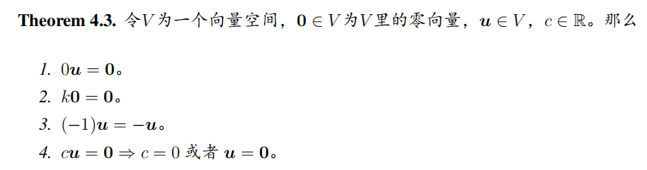

# Linear Algebra Tutorial6
2023.11.14

---

# homework
- about cross product 
    is applicable **only** to vectors in 3-space

- the norm of a vector
    $\left\|\mathbf{v}\right\|=\sqrt{v_1^2+v_2^2+\cdots+v_n^2}$

- the projection of a vector
    $proj_{\mathbf{u}}\mathbf{v}=\dfrac{\mathbf{u}\cdot\mathbf{v}}{\left\|\mathbf{u}\right\|^2}\mathbf{u}$

---

# determinant practice

---

# exercise

- $\mathbf{a}, \mathbf{b}, \mathbf{c}$ satisfy $\mathbf{a} + \mathbf{b} + \mathbf{c} = \textbf{0}$ and $\left\|\mathbf{a}\right\| = 3, \left\|\mathbf{b}\right\| = 5, \left\|\mathbf{c}\right\| = 7$.
find the angle between $\mathbf{a}$ and $\mathbf{b}$

- $\left\|\mathbf{a}\right\| = 2, \left\|\mathbf{b}\right\| = \sqrt{2}, \mathbf{a} \cdot \mathbf{b} = 2$.
find $\left\|\mathbf{a}\times\mathbf{b}\right\|$

---

# representation of lines and planes
- line
$\mathbf{r}=\mathbf{r}_0+t\mathbf{v}$
$\dfrac{x-x_0}{v_1}=\dfrac{y-y_0}{v_2}=\dfrac{z-z_0}{v_3}$
$\mathbf{v}=(v_1,v_2,v_3)$ is the direction vector of the line

- plane
$\mathbf{r}=\mathbf{r}_0+s\mathbf{v}+t\mathbf{w}$
$n_1(x-x_0)+n_2(y-y_0)+n_3(z-z_0)=0$
$\mathbf{n}=(n_1,n_2,n_3)$ is the normal vector of the plane
$\mathbf{n}= \mathbf{v}\times\mathbf{w}$

---

# distance from a point to a line/plane

- line(2-dimensional):
from $P_0(x_0,y_0)$ to $ax+by+c=0$
$d = \dfrac{|ax_0+by_0+c|}{\sqrt{a^2+b^2}}$
$\mathbf{n}=(a,b)$ is the normal vector of the line

- plane(3-dimensional):
from $P_0(x_0,y_0,z_0)$ to $ax+by+cz+d=0$
$d = \dfrac{|ax_0+by_0+cz_0+d|}{\sqrt{a^2+b^2+c^2}}$
$\mathbf{n}=(a,b,c)$ is the normal vector of the plane

---

# homogeneous coordinates*
- In 2D space, a point $p(x,y)$

- its homogeneous coordinates
$p(x,y,1)$

- a vector $\mathbf{v}=(x,y)$
its homogeneous coordinates is
$\mathbf{v}=(x,y,0)$

- a line $ax+by+c=0$
its homogeneous coordinates is
$\mathbf{v}=(a,b,c)$

- benefit1:
we can judge whether a point is on the line by $\mathbf{v}\cdot\mathbf{p}=0$

---

# homogeneous coordinates*
benefit2:
- we can easily get the line crossing two points:
$\mathbf{l}= \mathbf{p}\times\mathbf{q}$

- we can easily get the intersection of two lines:
$\mathbf{x}= \mathbf{l}\times\mathbf{m}$

--- 

# homogeneous coordinates*

benefit3:
we can easily transform a point in Euclidean space

$\begin{bmatrix}
p' \\
1
\end{bmatrix} = \begin{bmatrix}
R & \mathbf{t} \\
0 & 1
\end{bmatrix} \begin{bmatrix}
p \\
1
\end{bmatrix}$

where $\begin{bmatrix}
R & \mathbf{t} \\
0 & 1
\end{bmatrix}$ is the transformation matrix

> https://zhuanlan.zhihu.com/p/625678401

---

# Eucledian space $\Rightarrow$ Vector space
$\mathbb{R}^n\Rightarrow V$
the Euclidean space $\mathbb{R}^n$ is a special kind of vector space $V$

---

# property of vector space

- If and only if the $10$ conditions are satisfied, then $V$ is a vector space.
- we call every element in the vector space "vector"
> compare with the properties of Euclidean space

---

- $+$ is an abstract operation, it may not be the addition in Euclidean space
    eg. we can define that $a+b=ab$
- $-u$ is the inverse(negative) of $u$, it may have $-u\neq -1u$
**but in vector space, $-u=-1u$**
- the most important thing is the defination of "+", "-", "$0$"
> the above defination may not be a vector space

---

# example of vector space
- $\mathbb{R}^n$
- $V=M_{m\times n}$
    "+" is the addition of matrices, $\mathbf{0}$ is the zero matrix
- all function $f:\mathbb{R}\to\mathbb{R}$ is the vector in $V=F(-\infty,+\infty)$
- the set of all polynomials of degree $\leq n$
    "+" the addtion for every coefficient

---

# theorem of vector space

---

# subspace

$V$ is a vector space, $W$ is a subset of $V$  **iff**

- $W$ is closed under addition
    $\forall \mathbf{u},\mathbf{v}\in W, \mathbf{u}+\mathbf{v}\in W$
- $W$ is closed under scalar multiplication
    $\forall \mathbf{u}\in W, \forall c\in \mathbb{R}, c\mathbf{u}\in W$

**$W$ is also a vector space**

---

# subspace

- the intersection of two subspaces is also a subspace
- the union of two subspaces is not necessarily a subspace(usually not)

---

# zero space

---

# span

---

# linear independence

---

# Coordinates and basis

