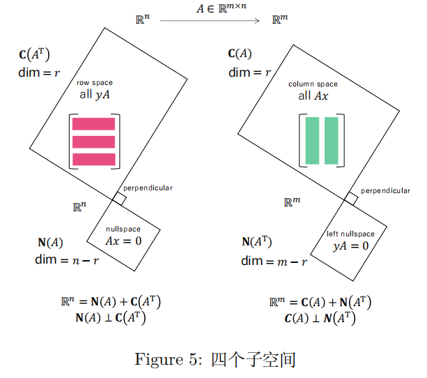
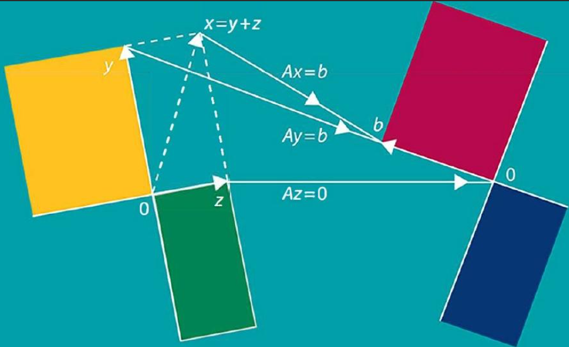

# Linear Algebra Tutorial 7
2023.11.21

---

# homework

---

# the dimension of a vector space
(defined in last tutorial)
$V$ is a finite-dimensional vector space, $S=\{\mathbf{v}_1,\cdots,\mathbf{v}_r\}$ is a subset of $V$
If
- $S$ is linearly independent
- $V=span(S)$

then we call $S$ a basis of $V$
the number of vectors in $S$ is the dimension of $V$, denoted as $dim(V)$

---

# the dimension of a vector space

---

# Plus/Minus Theorem

---

# Change of basis

---

# Row space, Column space and Null space

---

---
# Rank, Nullity and Fundamental Matrix Spaces
