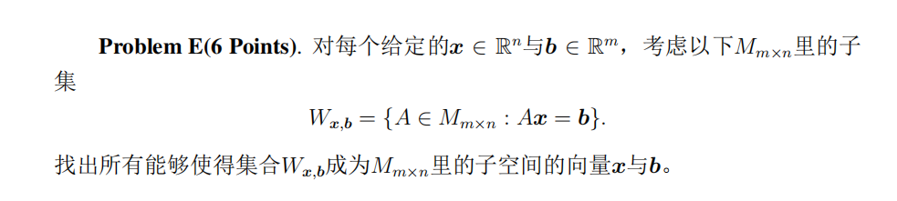
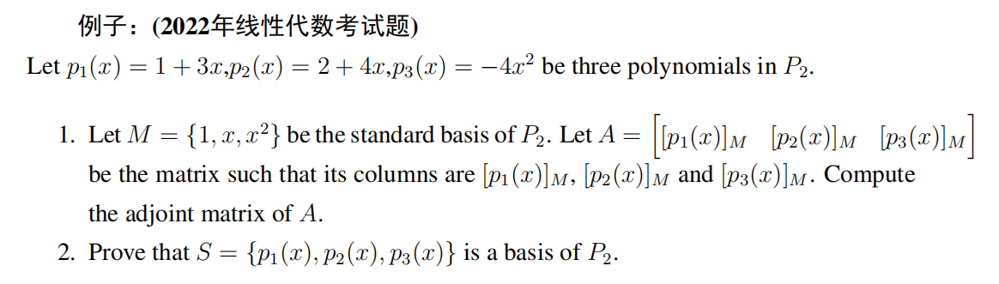

# Linear Algebra Tutorial 7
2023.11.21

---

# homework
- $P_n$ 所有次数$\leq n$的多项式的集合
  $P_n=\{p(x)=a_0+a_1x+a_2x^2+\cdots+a_nx^n:a_1,\cdots,a_n\in\mathbb{R}\}$

- matrix has no Binomial Theorem
e.g. $(A+B)^2=A^2+AB+BA+B^2$
$AB$ may not equal to $BA$!!!

- a small tip for hw7
  $\sin(\alpha+\beta)=\sin\alpha\cos\beta+\cos\alpha\sin\beta$
  $\cos(\alpha+\beta)=\cos\alpha\cos\beta-\sin\alpha\sin\beta$
  $\cos(2\alpha)=\cos^2\alpha-\sin^2\alpha=2\cos^2\alpha-1=1-2\sin^2\alpha$
---

# homework

- for the problem E:

$A\mathbf{x}=\mathbf{0}\not\Rightarrow \mathbf{x}=\mathbf{0}$

---

# midterm review 期中复习
- 考试时间: 2023.12.6 星期三 8:15~9:55
- 考试地点: 教学中心202
- 考试内容: 第一章到第四章的4.8节（包含）
- 期中考试占总成绩 30%! 
- 试卷为全英文, 不涉及数学的问题可以找监考人员翻译
- 作答中英文均可

> 欢迎大家有问题随时在群里/私聊提问, 尽量不要拖延问题
> 尽早复习，不要等到考前一天才开始复习
> start early!!!

---

# 一些要强调的事情
- **iff** $\Leftrightarrow$ if and only if $\Leftrightarrow$ 当且仅当, 
$\Rightarrow$ 充分性, $\Leftarrow$ 必要性, 都要证
或者全程使用$\Leftrightarrow$等价表述

- free variables
eg. $x_3=s,x_4=r$
**$s,r\in \mathbf{R}$**!

- consistent 有解的
- inconsistent 无解的
- trival solution 平凡解(无解)
- the symbol [] and || 
  [] for matrix, || for determinant

---
# 一些要强调的事情

- 注意公式不要记错了
    - $\left\|\mathbf{v}\right\|=\sqrt{v_1^2+v_2^2+\cdots+v_n^2}$ 不要忘记根号
    - $\cos\theta=\frac{\mathbf{u}\cdot\mathbf{v}}{\left\|\mathbf{u}\right\|\left\|\mathbf{v}\right\|}$ 分母不要忘记开方
    - $proj_{\mathbf{v}}\mathbf{u}=\frac{\mathbf{u}\cdot\mathbf{v}}{\left\|\mathbf{v}\right\|^2}\mathbf{v}$ 分母不要忘记平方,公式背不过的话可以自己考场推一下

$A=\begin{bmatrix}
1 & 0 & 1 \\
0 & 2 & 0 \\
-2 & 0 & 1
\end{bmatrix}$
- $A+I=?,A-I=?$ 注意$I$是单位矩阵,只有对角线上的元素为1!!!
- $P_n$ 所有次数$\leq n$的多项式的集合
  $P_n=\{p(x)=a_0+a_1x+a_2x^2+\cdots+a_nx^n:a_1,\cdots,a_n\in\mathbb{R}\}$

---
# 一些要强调的事情

- 行列式交换两行后，记得要有一个负号
- 关于叉乘
  $\mathbf{u}\times\mathbf{v}=\begin{vmatrix}
  \mathbf{i} & \mathbf{j} & \mathbf{k} \\
  u_1 & u_2 & u_3 \\
  v_1 & v_2 & v_3
  \end{vmatrix}=(u_2v_3-u_3v_2,-(u_1v_3-u_3v_1),u_1v_2-u_2v_1)$
  注意中间有个负号(原因:$a_{12}$的代数余子式的符号是$(-1)^{1+2}$)
- 行列式按行/列的展开时:
  $|A|=\sum\limits_{i=1}^na_{ij}C_{ij}$
  注意$C_{ij}$是$a_{ij}$的**代数余子式**,有一个$(-1)^{i+j}$!!!
- 矩阵没有二项式定理
e.g. $(A+B)^2=A^2+AB+BA+B^2$

---

# review list 复习清单
- chapter1 线性方程组
  - 矩阵
  - 高斯消元
  - 矩阵求逆
- chapter2 行列式
- chapter3 欧氏空间
- chapter4 向量空间
  - 子空间
  - 线性相关、线性无关
  - 基、维数、基变换
  - 行空间、 列空间、 零空间
  - 矩阵的秩、零度、 矩阵基本空间

---

# the dimension of a vector space
(defined in last tutorial)
$V$ is a finite-dimensional vector space, $S=\{\mathbf{v}_1,\cdots,\mathbf{v}_r\}$ is a subset of $V$
If
- $S$ is linearly independent
- $V=span(S)$

then we call $S$ a basis of $V$
the number of vectors in $S$ is the dimension of $V$, denoted as $dim(V)$

---

# coordinate 
$S=\{\mathbf{v}_1,\cdots,\mathbf{v}_n\}\subset \mathbb{R}^n$ is a basis of $\mathbb{R}^n$
$\forall\mathbf{v}\in V$, $\exists c_1,\cdots,c_n\in\mathbb{R}$ s.t.
$\mathbf{v}=c_1\mathbf{v}_1+\cdots+c_n\mathbf{v}_n$

coordinate vector of $\mathbf{v}$ relative to $S$
$(\mathbf{v})_S=(c_1,\cdots,c_n)$
> the coordinate is actually the coefficient of the linear combination

---

# the dimension of a vector space

The dimension of $V$ is the number of vectors in any basis of $V$

- $\dim(\mathbb{R}^n)=n$
- $\dim (P_n)=n+1$
- $\dim (M_{m\times n})=\dim(\mathbb{R}^{mn})=mn$
- for zero space $\dim(\{\mathbf{0}\})=0$

---

# dimension and basis
$S=\{\mathbf{v}_1,\cdots,\mathbf{v}_n\}$
- $W=span(S)$, then $S$ is a basis of $W$
- if $S$ is a linear independent set
  $\dim(W)=\dim(span(S))=|S|=n$

---
# dimension and basis
$S=\{\mathbf{v}_1,\cdots,\mathbf{v}_n\}$ be the basis of $V$
- notice that $S$ is a independent set
- if $m>n$, then $M=\{\mathbf{w}_1,\cdots,\mathbf{w}_m\}$ must be a **linear dependent** set
- if $m<n$, then $M=\{\mathbf{w}_1,\cdots,\mathbf{w}_m\}$ must **not span** $V$
$\Downarrow$
- If $S=\{\mathbf{v}_1,\cdots,\mathbf{v}_n\}$, $M=\{\mathbf{w}_1,\cdots,\mathbf{w}_m\}$ are basis of $V$, then $n=m$

---

# Plus/Minus Theorem
$V$ is a vector space, $S\subset V$
- If $S$ is an independent set, and $\mathbf{v}\in V, \mathbf{v}\not\in S$, then $S\cup\{\mathbf{v}\}$ is also an **independent set**
> proof by contradiction, suppose that $S\cup\{\mathbf{v}\}$ is linear dependent $\Rightarrow\mathbf{v}=span(S)$

- If $\mathbf{v}\in S$, and $\mathbf{v}$ can be written as a linear combination of other vectors in $S$, then $span(S-\mathbf{v})=span(S)$
> $\mathbf{v}\in S$, WLOG, take $\mathbf{v}=v_1$, consider $\forall\mathbf{w}\in span(S)$, can be writen as linear combination of $\mathbf{v}_2,\cdots,\mathbf{v}_n$

---

# coordinate
$n\geq 1, \dim(V)=n, S=\{\mathbf{v}_1,\cdots,\mathbf{v}_n\}$ is a basis of $V$

- $1.$ for any vector set $M=\{\mathbf{w}_1,\cdots,\mathbf{w}_r\}\subset V$
$M$ is an independent set $\Leftrightarrow$ $[\mathbf{v}_1]_S,\cdots,[\mathbf{v}_r]_S$ are independent set
> proof: set $[\mathbf{v}_i]=(a_{i1},\cdots,a_{in})$, then $\mathbf{v}_i=a_{i1}\mathbf{v}_1+\cdots+a_{in}\mathbf{v}_n$

- $2.$ for vector set $M=\{\mathbf{w}_1,\cdots,\mathbf{w}_n\}\subset V$
  $M$ is the basis of $V\Leftrightarrow$ $[\mathbf{v}_1]_S,\cdots,[\mathbf{v}_n]_S$ is the basis of $\mathbb{R}^n$
  $\Leftrightarrow$ $[\mathbf{v}_1]_S,\cdots,[\mathbf{v}_n]_S$ is the standard basis of $\mathbb{R}^n$
> from $1.$, we know that $M$ is independent $\Rightarrow$ $[\mathbf{v}_1]_S,\cdots,[\mathbf{v}_n]_S$ is independent, so we just need to prove that $span\{[\mathbf{w}_1]_S,\cdots,[\mathbf{w}_n]_S\}=\mathbb{R}^n$

---
# example

---
# basis theorem
$V$ is a vector space,$\dim(V)=n$, $S=\{\mathbf{v}_1,\cdots,\mathbf{v}_m\}\subset V$
- $span(S)=V, m>n$, then we can delete some of the vectors in $S$ to get a basis of $V$
- if $S$ is a linear independent set, $m<n$, then we can add some vectors to $S$ to get a basis of $V$
---
# basis theorem
$V$ is a vector space, $\dim(V)=n$, $W\subset V$ is a subspace.
- let $m=\dim(W)$, then $m\leq n$
- $W=V$ **iff** $m=n$

---

# Change of basis

$V$ is the vector space, $B,B'$ are two bases of $V$
- $B=\{\mathbf{v}_1,\cdots,\mathbf{v}_n\}$
- $B'=\{\mathbf{v}_1',\cdots,\mathbf{v}_n'\}$
If we have $(\mathbf{v})_B=(c_1,\cdots,c_n)$ 
how could we find $(\mathbf{v})_{B'}=(c_1',\cdots,c_n')$?

---

# Change of basis

- transition matrix(过渡矩阵)
  $P=\begin{bmatrix}
  \mathbf{v}_1' & \cdots & \mathbf{v}_n'
  \end{bmatrix}$
  $P$ is invertible, $P^{-1}$ is called the transition matrix from $B$ to $B'$

- transition matrix from $B$ to $B'$
  $P_{B\to B'}$ or $P_{B'\leftarrow B}$
- transition matrix from $B'$ to $B$
  $P_{B'\to B}$ or $P_{B\leftarrow B'}$
> notice that the defination of the transition matrix may be different with some of the Chinese textbooks!!

---

# Change of basis
- We can represent the transition matrix as  $P_{B\to B'}$ or $P_{B'\leftarrow B}$

- $(v)_{B'}=P_{B'\leftarrow B}(v)_{B}$

- method to get the transition matrix
  $[B'|B]\Rightarrow [I|P_{B'\leftarrow B}]$

---

