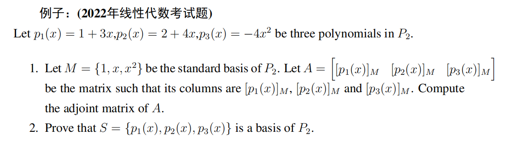
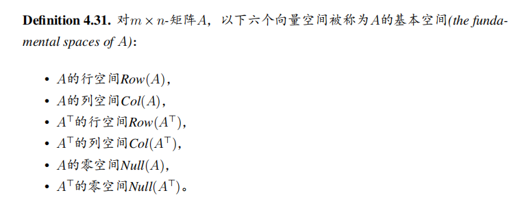

# Linear Algebra Tutorial8

2023.11.28

---

# homework

- 

---

# Plus/Minus Theorem
$V$ is a vector space, $S\subset V$
- If $S$ is an independent set, and $\mathbf{v}\in V, \mathbf{v}\not\in S$, then $S\cup\{\mathbf{v}\}$ is also an **independent set**
> proof by contradiction, suppose that $S\cup\{\mathbf{v}\}$ is linear dependent $\Rightarrow\mathbf{v}=span(S)$

- If $\mathbf{v}\in S$, and $\mathbf{v}$ can be written as a linear combination of other vectors in $S$, then $span(S-\mathbf{v})=span(S)$
> $\mathbf{v}\in S$, WLOG, take $\mathbf{v}=v_1$, consider $\forall\mathbf{w}\in span(S)$, can be writen as linear combination of $\mathbf{v}_2,\cdots,\mathbf{v}_n$

---

# coordinate
$n\geq 1, \dim(V)=n, S=\{\mathbf{v}_1,\cdots,\mathbf{v}_n\}$ is a basis of $V$

- $1.$ for any vector set $M=\{\mathbf{w}_1,\cdots,\mathbf{w}_r\}\subset V$
$M$ is an independent set $\Leftrightarrow$ $[\mathbf{v}_1]_S,\cdots,[\mathbf{v}_r]_S$ are independent set
> proof: set $[\mathbf{v}_i]=(a_{i1},\cdots,a_{in})$, then $\mathbf{v}_i=a_{i1}\mathbf{v}_1+\cdots+a_{in}\mathbf{v}_n$

- $2.$ for vector set $M=\{\mathbf{w}_1,\cdots,\mathbf{w}_n\}\subset V$
  $M$ is the basis of $V\Leftrightarrow$ $[\mathbf{v}_1]_S,\cdots,[\mathbf{v}_n]_S$ is the basis of $\mathbb{R}^n$
  $\Leftrightarrow$ $[\mathbf{v}_1]_S,\cdots,[\mathbf{v}_n]_S$ is the standard basis of $\mathbb{R}^n$
> from $1.$, we know that $M$ is independent $\Rightarrow$ $[\mathbf{v}_1]_S,\cdots,[\mathbf{v}_n]_S$ is independent, so we just need to prove that $span\{[\mathbf{w}_1]_S,\cdots,[\mathbf{w}_n]_S\}=\mathbb{R}^n$

---
# example

---
# basis' theorem
$V$ is a vector space,$\dim(V)=n$, $S=\{\mathbf{v}_1,\cdots,\mathbf{v}_m\}\subset V$
- $span(S)=V, m>n$, then we can delete some of the vectors in $S$ to get a basis of $V$
- if $S$ is a linear independent set, $m<n$, then we can add some vectors to $S$ to get a basis of $V$
---
# basis' theorem
$V$ is a vector space, $\dim(V)=n$, $W\subset V$ is a subspace.
- let $m=\dim(W)$, then $m\leq n$
- $W=V$ **iff** $m=n$

---

# Change of basis

$V$ is the vector space, $B,B'$ are two bases of $V$
- $B=\{\mathbf{v}_1,\cdots,\mathbf{v}_n\}$
- $B'=\{\mathbf{v}_1',\cdots,\mathbf{v}_n'\}$
If we have $(\mathbf{v})_B=(c_1,\cdots,c_n)$ 
how could we find $(\mathbf{v})_{B'}=(c_1',\cdots,c_n')$?
> as we known that $[\mathbf{v}]_B, [\mathbf{v}]_{B'}$ has the unique expression

---

# Change of basis

- transition matrix(过渡矩阵/转移矩阵) $P$
  $P$ is invertible, $P^{-1}$ is called the transition matrix from $B$ to $B'$

- transition matrix from $B$ to $B'$
  $P_{B\to B'}$ or $P_{B'\leftarrow B}$
- transition matrix from $B'$ to $B$
  $P_{B'\to B}$ or $P_{B\leftarrow B'}$
- $P_{B\leftarrow B'}P_{B'\leftarrow B}=I$
> notice that the defination of the transition matrix may be different with some of the Chinese textbooks!!

---

# Change of basis
- We can represent the transition matrix as  $P_{B\to B'}$ or $P_{B'\leftarrow B}$

- $[v]_{B'}=P_{B'\leftarrow B}[v]_{B}$
- $[v]_{B}=P_{B\leftarrow B'}[v]_{B'}$

- method to get the transition matrix
  $[B'|B]\Rightarrow [I|P_{B'\leftarrow B}]$

---

# example of transition matrix

---

# Row space, Column space and Null space
$A$ is a $m\times n$ matrix
- row space 行空间
  $row(A)=span\{\mathbf{r}_1,\cdots,\mathbf{r}_m\}$

- column space 列空间
  $col(A)=span\{\mathbf{c}_1,\cdots,\mathbf{c}_n\}$
- null space 零空间
  $null(A)=\{\mathbf{x}\in\mathbb{R}^n:A\mathbf{x}=\mathbf{0}\}$
- left null space 左零空间 
  $null(A^T)=\{\mathbf{x}\in\mathbb{R}^m:A^T\mathbf{x}=\mathbf{0}\}$

---

# Fundamental Matrix Spaces

- 行空间和零空间互为正交补
- 列空间和左零空间互为正交补

正交补(Orthogonal Complements)
> 正交: $col(A)\perp null(A)$
补: $col(A)+null(A)=\mathbb{R}^n$

> 
> 

---
# Row space, Column space and Null space

---

---
# Null space
For a linear system $A\mathbf{x}=\mathbf{b}$
We can write the solutions as 
$\mathbf{s}=\mathbf{s}_0+c_1\mathbf{v}_1+\cdots+c_k\mathbf{v}_k$
where $\mathbf{s}_0$ is a particular solution, $\mathbf{v}_1,\cdots,\mathbf{v}_k$ is the basis of the null space of $A$

- $\mathbf{s}_0:$ 特解
- $Null(A)=span\{\mathbf{v}_1,\cdots,\mathbf{v}_k\}$
  so $\mathbf{v}_1,\cdots,\mathbf{v}_k$ are the basis of the null space of $A$

---
# Rank, Nullity

- $rank(A)=dim(row(A))=dim(col(A))$
  $A$ 的秩 = A 的行阶梯矩阵的首一个数
  $\Rightarrow rank(A)\leq\min(n,m)$

- $rank(A)$ 可看作行阶梯矩阵的首一(非零行/主元) 个数
  $nullity(A)=dim(Null(A))$ 可看作自由元的个数
  $\Rightarrow rank(A)+nullity(A)=n$

---

# Equivalent expression
$A\in M_{n\times n}$

---

# Geometry review
- detail in tutorial 5

- 平面的一般式
$Ax+By+Cz+D=0$

- 平面的法向量
  $\mathbf{n}=(A,B,C)$

- 空间中一点$(x_0,y_0,z_0)$到平面的距离
  $d=\dfrac{|Ax_0+By_0+Cz_0+D|}{\sqrt{A^2+B^2+C^2}}$

- 过空间内一点$(x_0,y_0,z_0)$, 法向量为$\mathbf{v}=(a,b,c)$ 的平面的方程
  $a(x-x_0)+b(y-y_0)+c(z-z_0)=0$