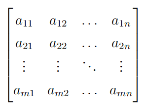

# Linear Algebra Tutorial8

2023.11.27

---

# midterm review 期中复习
- 考试时间: 2023.12.1 星期五 8:15-10:15
? maybe TBD
- 期中考试占总成绩 30%! 
-

# ppt中英文结合！！
作答中英文？？
试卷英文？ 不会的单词可以随时向助教提问

> 欢迎大家有问题随时在群里/私聊提问, 尽量不要拖延问题

---

# chapter 1
- 
- 
- 

---

# coeffcient matrix(系数矩阵) & 
# augmented matrix(增广矩阵)

 

系数矩阵 $A$ and 增广矩阵 $\bar{A}=(A|\mathbf{b})$

---

# 初等行变换
- 交换两行
- 用一个非零常数乘以某一行
- 用一个非零常数乘以某一行，然后加到另一行上

> 注意化简矩阵的时候的符号写法, 写出矩阵的化简方式

---

## row echelon form(行阶梯矩阵)
- leading 1(首1/主1/主元......)
- Any row in the matrix that is 0 must be below the row that is not 0
- upper row's leading 1 must be to the left of the lower row's leading 1

## reduced row echelon form(简化行阶梯矩阵)

- The leading 1 contained in any row of the matrix that is not 0 is the only term in the column that is not 0

---

# Gauss elimination
1. no solution
2. fixed solution
3. infinite solutions

---

# leading variable & free variable

$B$ is an augmented matrix of a linear system, its row echelon form is $\tilde{B}$

The unknowns corresponding to the leading 1 in the rows that are not 0 in $\tilde{B}$ are called the **leading variables** of the system of equations, and all the unknowns other than the leading variables are called the **free variables** of the system of equations.

---

# chapter 2
-

---

# chapter 3

---

# chapter 4

