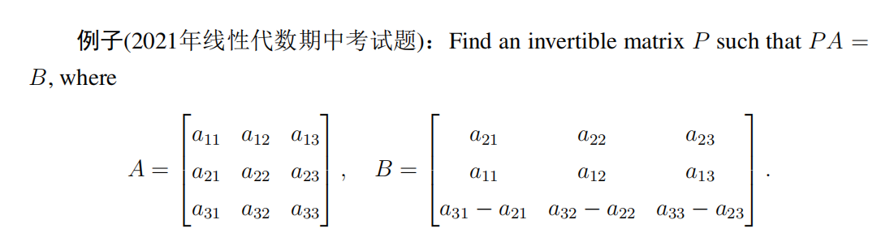
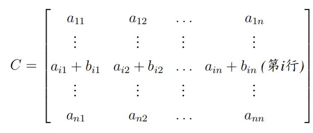
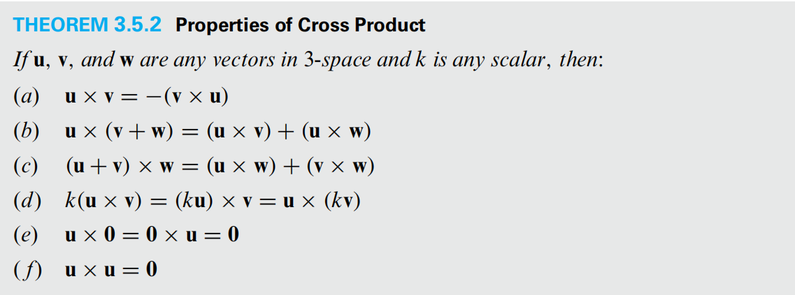
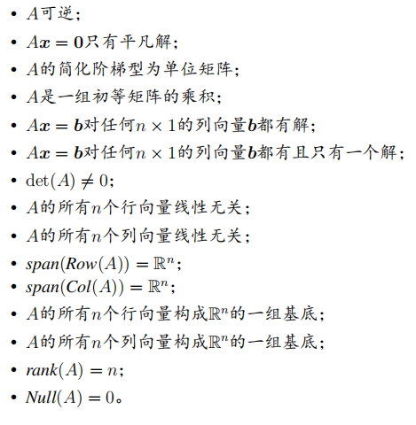

# Linear Algebra Tutorial 9
2023.12.5

---

# homework

- TBD

---

# midterm review 期中复习
- 考试时间: 2023.12.6 星期三 8:15~9:55
- 考试地点: 教学中心202
- 考试内容: 第一章到第四章的4.8节（包含）
- 期中考试占总成绩 30%
- 试卷为全英文, 不涉及数学的问题可以找监考人员翻译
- 作答中英文均可

---

# 一些要强调的事情
- **iff** $\Leftrightarrow$ if and only if $\Leftrightarrow$ 当且仅当, 
$\Rightarrow$ 充分性, $\Leftarrow$ 必要性, 都要证
或者全程使用$\Leftrightarrow$等价表述

- free variables
eg. $x_3=s,x_4=r$
**$s,r\in \mathbf{R}$**

- consistent 有解的
- inconsistent 无解的
- trival solution 平凡解(零解)
- the symbol [] and || 
  [] for matrix, || for determinant

---
# 一些要强调的事情

- 注意公式不要记错了
    - $\left\|\mathbf{v}\right\|=\sqrt{v_1^2+v_2^2+\cdots+v_n^2}$ 不要忘记根号
    - $\cos\theta=\frac{\mathbf{u}\cdot\mathbf{v}}{\left\|\mathbf{u}\right\|\left\|\mathbf{v}\right\|}$ 分母不要忘记开方
    - $proj_{\mathbf{v}}\mathbf{u}=\frac{\mathbf{u}\cdot\mathbf{v}}{\left\|\mathbf{v}\right\|^2}\mathbf{v}$ 分母不要忘记平方,公式背不过的话可以自己考场推一下

$A=\begin{bmatrix}
1 & 0 & 1 \\
0 & 2 & 0 \\
-2 & 0 & 1
\end{bmatrix}$
- $A+I=?,A-I=?$ 注意$I$是单位矩阵,只有对角线上的元素为1!!!
- $P_n$ 所有次数$\leq n$的多项式的集合
  $P_n=\{p(x)=a_0+a_1x+a_2x^2+\cdots+a_nx^n:a_1,\cdots,a_n\in\mathbb{R}\}$

---
# 一些要强调的事情

- 行列式交换两行后，记得要有一个负号
- 关于叉乘
  $\mathbf{u}\times\mathbf{v}=\begin{vmatrix}
  \mathbf{i} & \mathbf{j} & \mathbf{k} \\
  u_1 & u_2 & u_3 \\
  v_1 & v_2 & v_3
  \end{vmatrix}=(u_2v_3-u_3v_2,-(u_1v_3-u_3v_1),u_1v_2-u_2v_1)$
  注意中间有个负号(原因:$a_{12}$的代数余子式的符号是$(-1)^{1+2}$)
- 行列式按行/列的展开时:
  $|A|=\sum\limits_{i=1}^na_{ij}C_{ij}$
  注意$C_{ij}$是$a_{ij}$的**代数余子式**,有一个$(-1)^{i+j}$
- 矩阵没有二项式定理(本质:矩阵乘法没有交换律)
e.g. $(A+B)^2=A^2+AB+BA+B^2$

---

# review list 复习清单
- chapter1 线性方程组
  - 矩阵
  - 高斯消元
  - 矩阵求逆
- chapter2 行列式
- chapter3 欧氏空间
- chapter4 向量空间
  - 子空间
  - 线性相关、线性无关
  - 基、维数、基变换
  - 行空间、 列空间、 零空间
  - 矩阵的秩、零度、 矩阵基本空间

---

# chapter 1 线性方程组
- 线性方程组
- 高斯消元
- 矩阵运算
- 矩阵求逆
- 特殊矩阵

---

## coeffcient matrix(系数矩阵) & augmented matrix(增广矩阵)

 

系数矩阵 $A$ and 增广矩阵 $\bar{A}=(A|\mathbf{b})$

---

## 初等行变换
- 交换两行
- 用一个非零常数乘以某一行
- 用一个非零常数乘以某一行，然后加到另一行上

> 注意化简矩阵的时候的符号写法, 写出矩阵的化简方式

---

## row echelon form(行阶梯矩阵)
- leading 1(首1/主1/主元......)
- $0$ 行必须在非零行的下面
- leading 1 的列必须在下一行的leading 1 的左边

## reduced row echelon form(简化行阶梯矩阵)

- 首1所在的列的其他元素都为0

---

## Gauss elimination 高斯消元
1. no solution 无解
2. 有解 
    1. unique solution 唯一解
    2. infinite solutions 无穷多解

---

## leading variable & free variable 主元 & 自由元

增广矩阵$B$的行阶梯矩阵为$\tilde{B}$
主元: $\tilde{B}$中的leading 1对应的元素
自由元: $\tilde{B}$中的非主元对应的元素

---

## 矩阵运算
- 矩阵加法
  注意$A+1=A+I$
  只把对角线上的元素$+1$
- 矩阵乘法
  $A_{m\times n}B_{n\times p}=C_{m\times p}$
  - 矩阵乘法没有交换律
    所以矩阵没有二项式定理  
    $AB\neq BA$
    $(A+B)^2=A^2+AB+BA+B^2$

---

## 矩阵求逆
1. 伴随矩阵 $A^*$, $adj(A)$
- $C_{i,j}$: $a_{i,j}$的**代数余子式**
- $C$ : $A$的代数余子式矩阵
- $A^*=adj(A)=C^T$
- **无论 $A$ 是否可逆**都有$AA^*=A^*A=|A|I$
- 若$A$可逆, $A^{-1}=\dfrac{1}{|A|}A^*$
2. $[A|I]\Rightarrow [I|A^{-1}]$
  基础行变换
  > 不能同时使用基础行变换和基础列变换

---

## 矩阵的基础变换
- 基础矩阵: 由单位矩阵经过一次初等行变换得到的矩阵
  - 交换两行
  - 用一个非零常数乘以某一行
  - 用一个非零常数乘以某一行，然后加到另一行上
- 左行右列
  基础行变换,左乘一系列基础矩阵
  基础列变换,右乘一系列基础矩阵

---

## 逆矩阵的性质

- $AA^{-1}=A^{-1}A=I$
- $(A^{-1})^{-1}=A$
- $(A^T)^{-1}=(A^{-1})^T$
- $(AB)^{-1}=B^{-1}A^{-1}$
- 矩阵的逆是唯一的

---

## 特殊矩阵

- 对角矩阵
- 上三角矩阵
- 下三角矩阵
  - 三角矩阵乘三角矩阵还是三角矩阵(使用时不需要证明,但需要说明)
  - 三角矩阵的逆还是三角矩阵
  > 上面的三角矩阵是同一种

- 对称矩阵
  $A^T=A$

- 矩阵的分块 

---

# chapter 2 行列式
- 行列式的定义
- 行列式的性质
- 行列式的计算
- 行列式的应用

---

## 行列式的定义

- 作用于方阵$A\in M_{n\times n}$上的函数
    $det:M_{n\times n}\rightarrow \mathbb{R}$

- 记作$|A|$或者$\det(A)$

- 特别的: 二阶行列式:
$A=\begin{bmatrix}
a_{11} & a_{12} \\
a_{21} & a_{22}
\end{bmatrix}$
$|A|=a_{11}a_{22}-a_{12}a_{21}$

---

## 行列式的性质

- $|A^T|=|A|$
- **$\lambda A = \lambda^n|A|$**
- $|AB|=|A||B|$
- $|A^{-1}|=\frac{1}{|A|}$

---

## 行列式的性质

> 对行列式可以同时进行基础行变换和基础列变换
以行变换为例

1. $B$ 由 $A$ 交换两行得到
  $|B|=-|A|$

2. $B$ 由 $A$ 用一个非零常数乘以某一行得到
  $|B|=k|A|$

3. $B$ 由 $A$ 用一个非零常数乘以某一行，然后加到另一行上得到
  $|B|=|A|$

---

## 行列式的性质

4. 由1. 若$A$有两行相同, 则$|A|=0$

e.g.
$A=\begin{bmatrix}
1 & 1 & 5 & 4 \\
2 & 3 & 2 & 4 \\
1 & 6 & 0 & 3 \\
4 & 2 & 5 & 1
\end{bmatrix}$

find $C_{21}+C_{22}+5C_{23}+4C_{24}$

where $C_{ij}$ is the cofactor of $a_{ij}$

---

## 行列式的性质

 

> $|C| = |A| + |B|$

---

## 行列式的计算

- 三角矩阵 / 对角矩阵
  $|A|=a_{11}a_{22}\cdots a_{nn}$

  > 使用基础行/列变换将矩阵化为三角矩阵/对角矩阵

- 按行/列展开
  $|A|=\sum\limits_{i=1}^na_{ij}C_{ij}$
  注意$C_{ij}$是$a_{ij}$的**代数余子式**,有一个$(-1)^{i+j}$

- 使用行列式性质进行简化

---

## 行列式的应用

1. Cramer's rule 克拉默法则
  求解单个变量的解

2. 判断矩阵是否可逆
  $|A|\neq 0 \Leftrightarrow A$可逆

3. 判断一组向量是否线性无关
  $|A|\neq 0 \Leftrightarrow A$线性无关

---

# chapter 3 欧氏空间
- 范数、内积、距离
- 正交、叉乘
- 欧式几何

---

## $\mathbb{R}^n$ (n维欧氏空间)

$\mathbf{v}\in\mathbb{R}^n$, $\mathbf{v}=(v_1,\cdots,v_n)$

- standard unit vector 标准单位向量
  $\mathbf{e}_i=(0,\cdots,0,1,0,\cdots,0)$
  $\{e_1,\cdots,e_n\}$ 是 $\mathbb{R}^n$ 的标准基

---

## 范数、内积、距离

- 范数 norm
  $\left\|\mathbf{v}\right\|=\sqrt{v_1^2+v_2^2+\cdots+v_n^2}$

- 内积 inner product
  $\mathbf{u}\cdot\mathbf{v}=u_1v_1+u_2v_2+\cdots+u_nv_n$

  > 若将$\mathbf{u},\mathbf{v}$看作列向量, 则$\mathbf{u}\cdot\mathbf{v}=\mathbf{u}^T\mathbf{v}=\mathbf{v}^T\mathbf{u}$

- 距离 distance
  $\left\|\mathbf{u}-\mathbf{v}\right\|=\sqrt{(u_1-v_1)^2+(u_2-v_2)^2+\cdots+(u_n-v_n)^2}$

---

## 正交、叉乘

- orthogonality 正交
  $\mathbf{u}\perp\mathbf{v} \Leftrightarrow \mathbf{u}\cdot\mathbf{v}=0$

- cross product 叉乘
  只作用在$\mathbb{R}^3$上
  $\mathbf{u}\times\mathbf{v}=\begin{vmatrix}
  \mathbf{i} & \mathbf{j} & \mathbf{k} \\
  u_1 & u_2 & u_3 \\
  v_1 & v_2 & v_3
  \end{vmatrix}=(u_2v_3-u_3v_2,-(u_1v_3-u_3v_1),u_1v_2-u_2v_1)$

  > $\mathbf{u}\times\mathbf{v}$是一个向量, 与$\mathbf{u},\mathbf{v}$都垂直

  注意第2项的负号

---

# cross product
$\mathbf{x}\times\mathbf{y}=\begin{bmatrix}
x_2y_3-x_3y_2 \\
x_3y_1-x_1y_3 \\
x_1y_2-x_2y_1
\end{bmatrix}$
- $\mathbf{x}\times\mathbf{y}$ is orthogonal to both $\mathbf{x}$ and $\mathbf{y}$
- $\left\|\mathbf{x}\times\mathbf{y}\right\|=\left\|\mathbf{x}\right\|\left\|\mathbf{y}\right\|sin\theta$

# Projection Theorem
- orthogonal projection of $\mathbf{u}$ on $\mathbf{v}$
$\mathbf{w}_1=proj_{\mathbf{v}}(\mathbf{u})=\dfrac{\mathbf{u}\cdot\mathbf{v}}{\left\|\mathbf{v}\right\|^2}\mathbf{v}$

- the vector component of \mathbf{u} orthogonal to \mathbf{v}
$\mathbf{w}_2=\mathbf{u}-\mathbf{w}_1=\mathbf{u}-proj_{\mathbf{v}}(\mathbf{u})=\mathbf{u}-\dfrac{\mathbf{u}\cdot\mathbf{v}}{\left\|v\right\|^2}\mathbf{v}$

# cross product property

## 欧式几何

scalar triple product 混合积(标量三重积)

$\mathbf{x}\cdot(\mathbf{y}\times\mathbf{z})=\begin{vmatrix}
x_1 & x_2 & x_3 \\
y_1 & y_2 & y_3 \\
z_1 & z_2 & z_3
\end{vmatrix}$
- $\mathbf{x}\cdot(\mathbf{y}\times\mathbf{z})=\mathbf{y}\cdot(\mathbf{z}\times\mathbf{x})=\mathbf{z}\cdot(\mathbf{x}\times\mathbf{y})$
- $\mathbf{x}\cdot(\mathbf{y}\times\mathbf{z})=\mathbf{0}\Leftrightarrow \mathbf{x},\mathbf{y},\mathbf{z}$ are coplanar
- $\mathbf{x}\cdot(\mathbf{x}\times\mathbf{y})=\mathbf{y}\cdot(\mathbf{y}\times\mathbf{x})=0$

- Lagrange’s identity
$\left\|\mathbf{u}\times\mathbf{v}\right\|^2=\left\|\mathbf{u}\right\|^2\left\|\mathbf{v}\right\|^2-(\mathbf{u}\cdot\mathbf{v})^2$

---

# cross product geometric meaning

- parallelogram area
    平行四边形面积
    $S=\bar{AB}*\bar{AC}sin\theta=\left\|\mathbf{AB}\times\mathbf{AC}\right\|$
- volume of parallelepiped
    平行六面体体积
    $V=S_{base}h=\left\|\mathbf{AB}\times\mathbf{AC}\right\|\cdot\left\|\mathbf{AD}\right\|cos\alpha=\mathbf{AD}\cdot(\mathbf{AB}\times\mathbf{AC})$

---

## 欧式几何

---

# chapter 4 向量空间
- 向量空间
- 子空间
- 线性相关、线性无关
- 基、维数、基变换
- 行空间、 列空间、 零空间
- 矩阵的秩、零化度、 矩阵基本空间

---

## 向量空间(线性空间) linear space/ vector space

---

## 子空间 subspace

1. 线性空间(向量空间)子集
2. 加法封闭性
    $\mathbf{u}

3. 数量积封闭性

--- 

## 线性相关、线性无关

---

## 基、维数、基变换

---

## 行空间、 列空间、 零空间

---

## 矩阵的秩、零化度、 矩阵基本空间

---

## Equivalent expression
$A\in M_{n\times n}$

