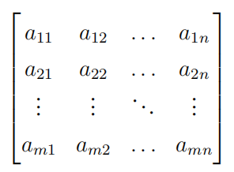
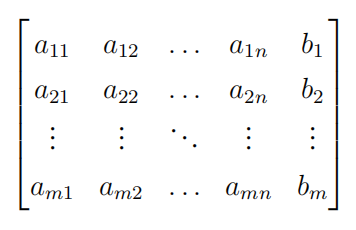

# Linear Algebra Tutorial 9
2023.12.5

---

# homework

- TBD

---

# midterm review 期中复习
- 考试时间: 2023.12.6 星期三 8:15~9:55
- 考试地点: 教学中心202
- 考试内容: 第一章到第四章的4.8节（包含）
- 期中考试占总成绩 30%! 
- 试卷为全英文, 不涉及数学的问题可以找监考人员翻译
- 作答中英文均可

> 欢迎大家有问题随时在群里/私聊提问, 尽量不要拖延问题
> 尽早复习，不要等到考前一天才开始复习
> start early!!!

---

# 一些要强调的事情
- **iff** $\Leftrightarrow$ if and only if $\Leftrightarrow$ 当且仅当, 
$\Rightarrow$ 充分性, $\Leftarrow$ 必要性, 都要证
或者全程使用$\Leftrightarrow$等价表述

- free variables
eg. $x_3=s,x_4=r$
**$s,r\in \mathbf{R}$**

- consistent 有解的
- inconsistent 无解的
- trival solution 平凡解(零解)
- the symbol [] and || 
  [] for matrix, || for determinant

---
# 一些要强调的事情

- 注意公式不要记错了
    - $\left\|\mathbf{v}\right\|=\sqrt{v_1^2+v_2^2+\cdots+v_n^2}$ 不要忘记根号
    - $\cos\theta=\frac{\mathbf{u}\cdot\mathbf{v}}{\left\|\mathbf{u}\right\|\left\|\mathbf{v}\right\|}$ 分母不要忘记开方
    - $proj_{\mathbf{v}}\mathbf{u}=\frac{\mathbf{u}\cdot\mathbf{v}}{\left\|\mathbf{v}\right\|^2}\mathbf{v}$ 分母不要忘记平方,公式背不过的话可以自己考场推一下

$A=\begin{bmatrix}
1 & 0 & 1 \\
0 & 2 & 0 \\
-2 & 0 & 1
\end{bmatrix}$
- $A+I=?,A-I=?$ 注意$I$是单位矩阵,只有对角线上的元素为1!!!
- $P_n$ 所有次数$\leq n$的多项式的集合
  $P_n=\{p(x)=a_0+a_1x+a_2x^2+\cdots+a_nx^n:a_1,\cdots,a_n\in\mathbb{R}\}$

---
# 一些要强调的事情

- 行列式交换两行后，记得要有一个负号
- 关于叉乘
  $\mathbf{u}\times\mathbf{v}=\begin{vmatrix}
  \mathbf{i} & \mathbf{j} & \mathbf{k} \\
  u_1 & u_2 & u_3 \\
  v_1 & v_2 & v_3
  \end{vmatrix}=(u_2v_3-u_3v_2,-(u_1v_3-u_3v_1),u_1v_2-u_2v_1)$
  注意中间有个负号(原因:$a_{12}$的代数余子式的符号是$(-1)^{1+2}$)
- 行列式按行/列的展开时:
  $|A|=\sum\limits_{i=1}^na_{ij}C_{ij}$
  注意$C_{ij}$是$a_{ij}$的**代数余子式**,有一个$(-1)^{i+j}$!!!
- 矩阵没有二项式定理
e.g. $(A+B)^2=A^2+AB+BA+B^2$

---

# review list 复习清单
- chapter1 线性方程组
  - 矩阵
  - 高斯消元
  - 矩阵求逆
- chapter2 行列式
- chapter3 欧氏空间
- chapter4 向量空间
  - 子空间
  - 线性相关、线性无关
  - 基、维数、基变换
  - 行空间、 列空间、 零空间
  - 矩阵的秩、零度、 矩阵基本空间

---

# chapter 1
- 
- 
- 

---

# coeffcient matrix(系数矩阵) & 
# augmented matrix(增广矩阵)

 

系数矩阵 $A$ and 增广矩阵 $\bar{A}=(A|\mathbf{b})$

---

# 初等行变换
- 交换两行
- 用一个非零常数乘以某一行
- 用一个非零常数乘以某一行，然后加到另一行上

> 注意化简矩阵的时候的符号写法, 写出矩阵的化简方式

---

## row echelon form(行阶梯矩阵)
- leading 1(首1/主1/主元......)
- Any row in the matrix that is 0 must be below the row that is not 0
- upper row's leading 1 must be to the left of the lower row's leading 1

## reduced row echelon form(简化行阶梯矩阵)

- The leading 1 contained in any row of the matrix that is not 0 is the only term in the column that is not 0

---

# Gauss elimination
1. no solution
2. fixed solution
3. infinite solutions

---

# leading variable & free variable

$B$ is an augmented matrix of a linear system, its row echelon form is $\tilde{B}$

The unknowns corresponding to the leading 1 in the rows that are not 0 in $\tilde{B}$ are called the **leading variables** of the system of equations, and all the unknowns other than the leading variables are called the **free variables** of the system of equations.

---

# chapter 2
- 行列式的定义
- 行列式的性质
- 行列式的计算

---

# 行列式的定义

- 作用于方阵$A\in M_{n\times n}$上的函数
    $det:M_{n\times n}\rightarrow \mathbb{R}$

- 记作$|A|$或者$\det(A)$

- 特别的: 二阶行列式:
$A=\begin{bmatrix}
a_{11} & a_{12} \\
a_{21} & a_{22}
\end{bmatrix}$
$|A|=a_{11}a_{22}-a_{12}a_{21}$

---

# chapter 3

---

# chapter 4
-
-
-

---

# Equivalent expression
$A\in M_{n\times n}$

